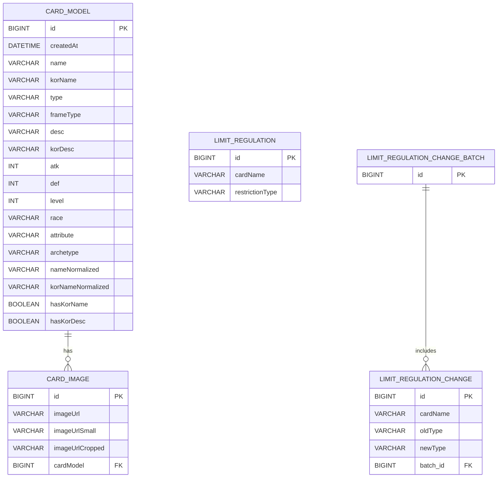

### YuGiOhDeck

---

**유희왕 덱 구성 및 공유 플랫폼**

---

## 목차

1. [개요](#개요)
2. [기간](#기간)
3. [기술 스택](#기술-스택)
4. [주요 기능](#주요-기능)
5. [설치 및 실행](#설치-및-실행)
6. [URL 덱 공유](#url-덱-공유)
7. [검색 및 Full-Text](#검색-및-full-text)
8. [크롤링 및 스케줄링](#크롤링-및-스케줄링)
9. [금지/제한 리스트 크롤링](#금지제한-리스트-크롤링)
10. [이미지 처리 및 API](#이미지-처리-및-api)
11. [트러블 슈팅](#트러블-슈팅)
12. [대기열 처리](#대기열-처리)
13. [장기간 미사용 사용자 처리](#장기간-미사용-사용자-처리)
14. [모니터링 및 분석](#모니터링-및-분석)
15. [디자인](#디자인)

---

## 개요


* 기존 덱 공유 방식의 한계: 영어·스크린샷 위주로 카드 정보 확인이 어려움
* **목표**: 한글·영어 지원 검색, URL 공유, UX 개선을 통해 덱 구성 경험 최적화

## 기간

* 2024년 7월 20일 – 2024년 7월 24일

## 기술 스택

* **백엔드**: Spring Boot, MySQL
* **프론트엔드**: JavaScript, CSS (Tailwind)
* **스토리지**: 로컬
* **자동화**: Jsoup, Selenium
* **검색**: MySQL Full-Text (ngram parser)

---

## 주요 기능

* 카드 검색 (영어/한글) 및 정렬
* 덱 작성·관리 (좌클릭 추가, 우클릭 삭제)
* URL에 덱 상태를 압축·인코딩하여 공유
* 카드 3D 회전·빛 반사 효과, 클릭 확대
* 덱 초기화(리셋) 및 로딩 대기열 처리

---

## 설치 및 실행

1. 리포지토리 클론

   ```bash
   git clone <repo-url>
   ```
2. 백엔드 실행

   ```bash
   ./gradlew bootRun
   ```
3. 프론트엔드 실행

   ```bash
   cd front/my-app
   npm install && npm start
   ```

---

## URL 덱 공유

```js
const dataObj = { cards: cardsContent, extra: extraDeckContent };
const compressed = pako.deflate(JSON.stringify(dataObj), { to: 'string' });
const encoded = btoa(compressed);
window.history.pushState({}, '', `?deck=${encodeURIComponent(encoded)}`);
```

* `pako`로 압축, `btoa`로 Base64 인코딩
* 크롬(8,192자), IE(2,083자)까지 지원, 최대 \~75장 이미지 공유 가능

---

## 검색 및 Full-Text

* **표준 JPQL** (prefix only):

  ```java
  @Query("""
  SELECT c FROM CardModel c
  WHERE (:frameType = '' OR c.frameType = :frameType)
    AND (LOWER(REPLACE(c.korName,' ','')) LIKE CONCAT(:norm,'%')
      OR LOWER(REPLACE(c.name,' ','')) LIKE CONCAT(:norm,'%'))
  """
  Page<CardModel> searchByNameContaining(...);
  ```
* **ngram Full-Text** (중간 검색 지원):

  ```sql
  ALTER TABLE card_model
    ADD COLUMN name_normalized VARCHAR(255)
      GENERATED ALWAYS AS (LOWER(REPLACE(name,' ',''))) STORED,
    ADD COLUMN kor_name_normalized VARCHAR(255)
      GENERATED ALWAYS AS (LOWER(REPLACE(kor_name,' ',''))) STORED;

  ALTER TABLE card_model
    ADD FULLTEXT INDEX ft_idx_name_norm
      (name_normalized, kor_name_normalized)
      WITH PARSER ngram;
  ```

  ```java
  @Query(value = """
    SELECT * FROM card_model
    WHERE (:frameType = '' OR frame_type = :frameType)
      AND MATCH(name_normalized, kor_name_normalized)
          AGAINST(:query IN BOOLEAN MODE)
    """, nativeQuery = true)
  Page<CardModel> searchByFullText(...);
  ```

---

## 크롤링 및 스케줄링

* **Jsoup**: 일주일 간 추가된 카드 크롤링, 한글명 업데이트

  ```java
  String encodedName = encodeCardName(card.getName());
  String primaryUrl = "https://yugioh.fandom.com/wiki/" + encodedName;
  String fallbackUrl = "https://yugipedia.com/wiki/"   + encodedName;

  Document doc = fetchDoc(primaryUrl);
  Document spareDoc = fetchDoc(fallbackUrl);

  // 이름 추출
  String korName = extractKorName(doc, spareDoc);
  if (korName != null) {
      card.setKorName(korName);
  } else {
      log.info("한국어 이름을 찾을 수 없습니다: {}", card.getName());
  }
  ```
* **스케줄 설정**: 매일/주기적으로 크롤링 스케줄러 등록

---

## 금지/제한 리스트 크롤링

* **Selenium**: Master Duel 리스트 추출

  ```java
  WebDriverWait wait = new WebDriverWait(driver, Duration.ofSeconds(10));
  WebElement banlistTypeElement = wait.until(ExpectedConditions.visibilityOfElementLocated(By.id("banlisttype")));
  // 'banlisttype'을 'Master Duel'로 설정
  Select banlistTypeSelect = new Select(banlistTypeElement);
  banlistTypeSelect.selectByValue("Master Duel");

  // 'banlistdate'를 최신 날짜로 설정
  WebElement banlistDateElement = wait.until(ExpectedConditions.visibilityOfElementLocated(By.id("banlistdate")));
  Select banlistDateSelect = new Select(banlistDateElement);
  banlistDateSelect.selectByIndex(0);  // 최신 항목을 선택

  // 'textView' 버튼 클릭
  WebElement textView = wait.until(ExpectedConditions.elementToBeClickable(By.id("textButton")));
  textView.click();

  ```

---

## 이미지 처리 및 API

* 외부 API에서 카드 이미지 수집, 로컬서버 저장
* 로컬 캐시 서버로 속도 최적화
* REST endpoint 제공

  ```java
      @GetMapping("/images/{filename}")
      public ResponseEntity<Resource> getImage(@PathVariable("filename") String filename) {
          try {
              Path imagePath = savePath.resolve(filename);
              Resource resource = new UrlResource(imagePath.toUri());

              if (resource.exists() || resource.isReadable()) {
                  return ResponseEntity.ok()
                      .header(HttpHeaders.CONTENT_DISPOSITION, "inline; filename=\"" + resource.getFilename() + "\"")
                      .body(resource);
              } else {
                  return ResponseEntity.notFound().build();
              }
          } catch(MalformedURLException e) {
              return ResponseEntity.badRequest().build();
          }
      }
  ```

---

## 대기열 처리

* zset으로 대기열을 구축
* 접속 유저 leave 시 자동으로 승급
* 접속 방치 유저 자동 퇴출
* score 별로 차등을 주어 우선 순위 줌

```java
    private void promoteNextUser(String qid) {
        String runKey  = RUNNING_PREFIX + qid;
        String vipKey  = WAITING_PREFIX + "vip";
        String mainKey = WAITING_PREFIX + "main";
        if (totalRunningSize() >= maxRunning()) return;

        TypedTuple<String> vipTuple  = firstWithScore(vipKey);
        TypedTuple<String> mainTuple = firstWithScore(mainKey);

        if (vipTuple == null && mainTuple == null) return;

        double vipScore  = vipTuple  == null ? Double.MAX_VALUE : vipTuple.getScore() - VIP_PRIORITY_BONUS;
        double mainScore = mainTuple == null ? Double.MAX_VALUE : mainTuple.getScore();

        String uid = "";
        boolean isVip = false;
        if (vipScore <= mainScore) {
            uid = vipTuple.getValue();
            isVip = true;
        } else {
            uid = mainTuple.getValue();
            isVip = false;
        }

        if (isVip) redis.opsForZSet().remove(vipKey, uid);
        else redis.opsForZSet().remove(mainKey, uid);

        redis.opsForZSet().add(runKey, uid, Instant.now().toEpochMilli());
        notifier.sendToUser(uid, "{\"type\":\"ENTER\"}");
    }
```
---


## 장기간 미사용 사용자 처리

* **TTL 설정:** Redis Sorted Set의 각 사용자 엔트리마다 score로 타임스탬프를 저장하고, `EXPIRE`를 걸어 세션 만료 시 자동 삭제
* **비활성 사용자 제어 로직:**

  1. `@Scheduled` 어노테이션을 사용하여 10초 주기로 모든 RUNNING ZSet 점검
  2. 현재 시각 기준으로 TTL (예: 5분) 초과 사용자를 검색 후 제거
  3. 세션 만료 사용자에게 WebSocket으로 `TIMEOUT` 메시지 전송 후 RUNNING ZSet에서 제거

```java
long cutoff = System.currentTimeMillis() - sessionTtlMillis();
Set<String> expired = redis.opsForZSet().rangeByScore(runKey, 0, cutoff);
expired.forEach(uid -> notifier.sendToUser(uid, "{\"type\":\"TIMEOUT\"}"));
```

* **Client 측 heartbeat 처리:**

  * React에서 `useCallback`으로 ping 메시지를 주기적으로 서버에 전송하여 세션 유지

```tsx
const sendPing = useCallback(() => {
    if (wsRef.current && wsRef.current.readyState === WebSocket.OPEN) {
      wsRef.current.send('PING');
    }
}, []);
```

## 트러블 슈팅

### ❗ 전역 WebDriver + @PostConstruct 초기화 문제

```text
java.lang.NullPointerException: Cannot invoke "org.openqa.selenium.WebDriver.get(String)" because "driver" is null
```

### 📌 원인

* `WebDriver`를 **전역 필드로 선언**하고 `@PostConstruct`에서 초기화했지만,
  이후정: 매번 새로 생성

```java
public WebDriver setup() {
    ChromeOptions options = new ChromeOptions();
    options.setBinary(System.getenv("WEB_DRIVER_CHROME_BIN"));
    options.addArguments("--headless", "--no-sandbox", "--disable-dev-shm-usage");
    return new ChromeDriver(options);
}

public void runCrawl() {
    WebDriver driver = setup();
    try {
        driver.get("https://example.com");
        ...
    } finally {
        driver.quit();
    }
}
```

> 💡 `WebDriver`는 재사용하지 말고, 작업마다 새로 생성하고 종료하는 구조로 변경하세요.

---


## 모니터링 및 분석

* **Google Analytics**: 사용자 행동 분석
* 덱 구성 빈도, 인기 카드 트렌드 추적
* UI/UX 개선 인사이트 수집

---
# erd



---


## Queue Patch Notes

대기열 Redis/WebSocket 처리에서 운영 중 문제될 수 있는 부분을 보완했다.

### 수정 내용

* WebSocket 재연결 시 이전 세션 종료가 곧바로 `leave()`로 이어지지 않도록 수정
* 동일 `userId`가 `vip`와 `main` running queue에 동시에 들어가지 못하도록 수정
* `leave()` 시 특정 qid만 지우지 않고 group 내 running/waiting membership을 함께 정리하도록 수정
* PING 갱신 시 현재 qid만 갱신하지 않고 실제 running 상태인 queue를 모두 갱신하도록 수정
* TTL 만료 스케줄러의 승급 로직에 `vip_streak` 제한을 반영해서 일반 승급과 동일한 공정성 규칙을 적용
* `/queue` API에서 `group`, `qid`, `userId`를 검증해서 잘못된 queue key가 Redis에 생기지 않도록 수정

### 수정 파일

* `src/main/java/com/card/Yugioh/security/QueueWebSocketHandler.java`
* `src/main/java/com/card/Yugioh/service/QueueService.java`
* `src/main/java/com/card/Yugioh/service/QueueJobService.java`
* `src/main/java/com/card/Yugioh/controller/QueueController.java`

### 기대 효과

* 브라우저 새로고침이나 일시적 재연결로 사용자가 대기열에서 잘못 이탈하는 문제 방지
* 동일 사용자 중복 입장으로 인한 running slot 오염 방지
* TTL 만료와 일반 퇴장 모두에서 일관된 승급 순서 유지
* 비정상 파라미터로 Redis key space가 오염되는 문제 방지

---

## Project Update Notes

이번 수정은 화면 완성도, 운영 안정성, 테스트 재현성, 정적 리소스 처리 효율을 함께 보완하는 방향으로 진행했다.

### 1. Frontend UI 정리

#### 왜 변경했는가

기존 프론트는 메인 화면, 사이드 메뉴, 관리자 페이지의 톤이 서로 달랐고, 일부 기능 버튼이 사라지거나 라우팅이 깨져 실제로 접근이 되지 않는 문제가 있었다. 또한 관리자 페이지와 AI 판별 모달에는 깨진 문자열과 급하게 붙인 상태 관리 코드가 남아 있어 유지보수가 어려웠다.

#### 무엇을 변경했는가

* 메인 덱 빌더 화면 레이아웃을 재구성하고 검색, 카드 상세, 덱 섹션, 공유 흐름을 다시 정리했다.
* `Limit Regulation`, `Queue Admin`, `AI 카드 판별` 버튼을 다시 연결했다.
* 관리자 페이지가 Router 밖에서 렌더링되던 문제를 수정해 실제로 페이지가 뜨도록 고쳤다.
* 사이드 메뉴와 관리자 페이지 스타일을 메인 화면과 같은 톤으로 통일했다.
* `AICardRecognizerModal.jsx`, `LimitBoard.jsx`를 정리해 깨진 문자열과 hook dependency 경고를 제거했다.

#### 무엇을 사용했고 왜 그걸 사용했는가

* React 상태 기반 렌더링을 유지했다.
  이유: 현재 프로젝트 구조를 크게 뒤엎지 않고도 화면 흐름을 안정적으로 복구할 수 있기 때문이다.
* 공용 CSS 파일을 정리하는 방식으로 스타일을 통일했다.
  이유: 디자인 시스템을 새로 도입하는 것보다 현재 규모에서는 유지비용이 낮고 적용 속도가 빠르기 때문이다.
* `useCallback`, `useRef`, effect 분리를 사용해 AI 모달 로직을 재구성했다.
  이유: WebSocket, polling, timeout, 업로드 상태가 섞인 컴포넌트에서 stale closure와 재실행 문제를 줄이기 위해서다.

#### 수정 파일

* `front/my-app/src/App.js`
* `front/my-app/src/App.css`
* `front/my-app/src/index.js`
* `front/my-app/src/QueueAdminPage.jsx`
* `front/my-app/src/styles/Menu.css`
* `front/my-app/src/styles/QueueAdminPage.css`
* `front/my-app/src/components/LimitPage.jsx`
* `front/my-app/src/components/AICardRecognizerModal.jsx`
* `front/my-app/src/components/LimitBoard.jsx`

### 2. Queue 안정성 보완

#### 왜 변경했는가

Redis + WebSocket 기반 대기열 구조 자체는 맞았지만, 재연결 시 잘못된 `leave()` 처리, `vip/main` 중복 running 진입, 만료 승급 규칙 불일치 같은 운영 장애 포인트가 있었다. 이런 문제는 실제 접속자가 늘면 순서 꼬임과 예기치 않은 이탈로 바로 드러난다.

#### 무엇을 변경했는가

* 재연결 시 이전 소켓 종료가 현재 활성 세션이 아닐 경우 큐 이탈로 이어지지 않도록 수정했다.
* 동일 사용자가 `vip`와 `main` running queue에 동시에 들어가지 못하도록 막았다.
* `leave()`와 `touch()`가 특정 qid만 보지 않고 group 전체 membership 기준으로 동작하도록 정리했다.
* TTL 만료 시 승급 로직에도 `vip_streak` 제한을 반영해 일반 승급 규칙과 일치시켰다.
* `/queue` API 입력값을 검증해 잘못된 queue key가 Redis에 생기지 않도록 했다.

#### 무엇을 사용했고 왜 그걸 사용했는가

* Redis Lua script를 유지하면서 보완했다.
  이유: queue 진입, 이탈, 승급은 원자성이 중요하고, 기존 구조를 살리면서 race condition을 가장 적게 만들 수 있기 때문이다.
* WebSocket 세션 맵에서 compare-and-remove 방식으로 현재 활성 세션만 정리하도록 바꿨다.
  이유: 브라우저 새로고침이나 일시적 재연결을 정상 흐름으로 처리하려면 "닫힌 세션이 최신 세션인가"를 구분해야 하기 때문이다.

#### 수정 파일

* `src/main/java/com/card/Yugioh/security/QueueWebSocketHandler.java`
* `src/main/java/com/card/Yugioh/service/QueueService.java`
* `src/main/java/com/card/Yugioh/service/QueueJobService.java`
* `src/main/java/com/card/Yugioh/controller/QueueController.java`

### 3. 보안, 설정, 테스트 정리

#### 왜 변경했는가

운영 자격증명이 코드와 설정 파일에 섞여 있으면 배포 환경 분리와 보안 관리가 어렵다. 또한 테스트가 외부 MySQL 환경에 직접 묶여 있으면 로컬과 CI에서 쉽게 깨지고, 코드 변경 검증 속도도 떨어진다.

#### 무엇을 변경했는가

* 관리자 계정을 하드코딩하지 않고 환경변수 기반 설정으로 이동했다.
* 애플리케이션 설정에서 DB, 이미지 경로, AI 서버 주소를 환경변수 기반으로 정리했다.
* 테스트 프로파일을 분리하고 H2 메모리 DB를 사용하도록 바꿨다.
* `ImageService`에서 컨트롤러 역할이 섞여 있던 애노테이션을 서비스 역할에 맞게 정리했다.

#### 무엇을 사용했고 왜 그걸 사용했는가

* Spring 환경변수 placeholder 방식을 사용했다.
  이유: 배포 환경마다 값을 바꿔야 하는 설정을 코드 수정 없이 주입할 수 있기 때문이다.
* 테스트는 H2 메모리 DB를 사용했다.
  이유: 지금 단계에서는 Testcontainers보다 설정이 가볍고, `./gradlew test`를 로컬에서 바로 재현하기 쉽기 때문이다.
* 정적 이미지는 `@GetMapping` 대신 `ResourceHandler`로 연결했다.
  이유: 이미지에는 비즈니스 로직이 없고, 서블릿 컨테이너가 직접 서빙하는 편이 Controller/Service를 거치는 것보다 단순하고 효율적이기 때문이다.

#### 수정 파일

* `src/main/java/com/card/Yugioh/security/SecurityConfig.java`
* `src/main/resources/application.properties`
* `src/test/java/com/card/Yugioh/YugiohApplicationTests.java`
* `src/test/resources/application-test.properties`
* `src/main/java/com/card/Yugioh/service/ImageService.java`

### 4. 검증

* Frontend: `npm run build`
* Backend: `./gradlew test`

### 5. Docker Compose + FastAPI 연동

`docker-compose.yml`은 이제 Spring, MySQL, Redis와 함께 FastAPI 서버도 같이 올리도록 구성되어 있다.


---

## 디자인


---

