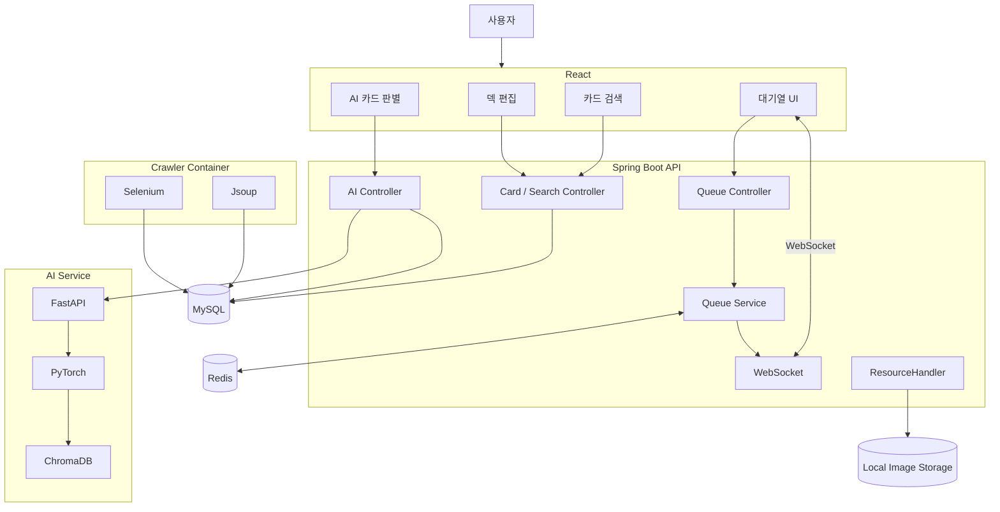
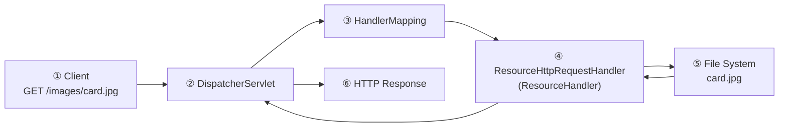
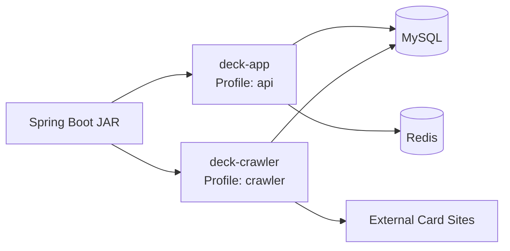
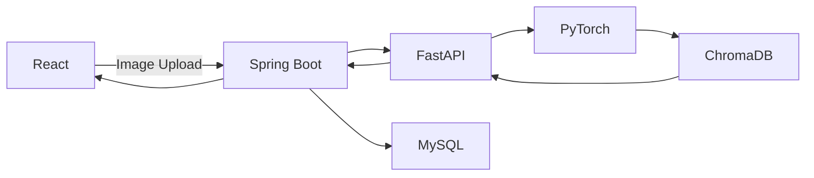
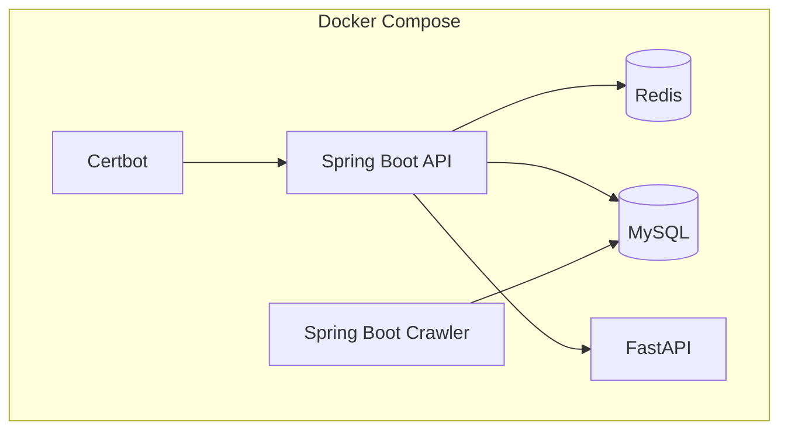
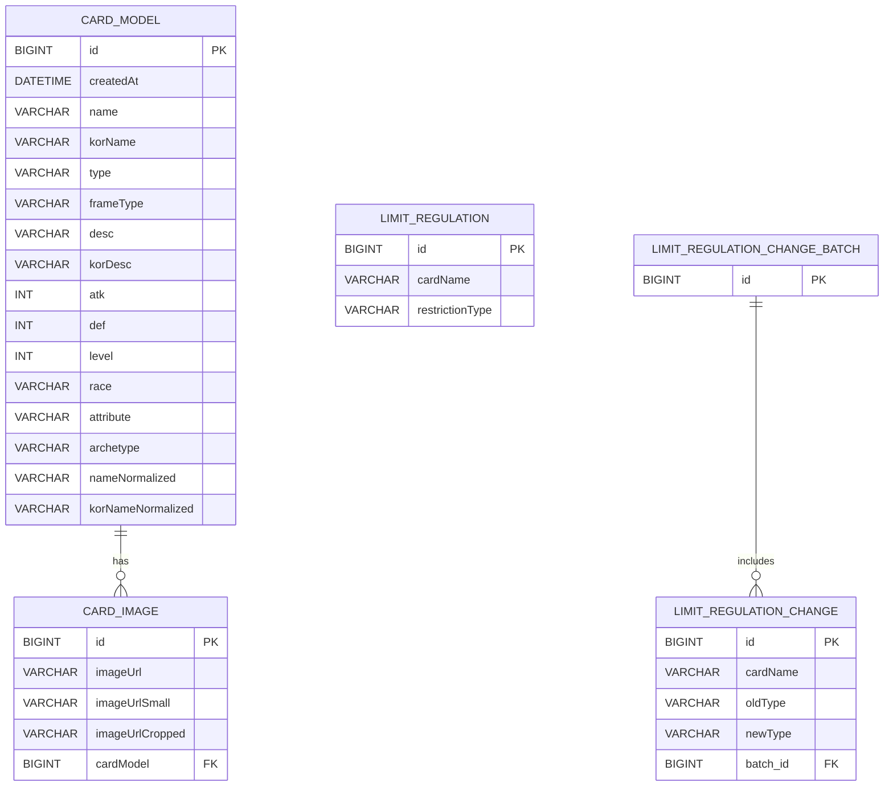

# YuGiOhDeck

**유희왕 덱 구성 및 공유 플랫폼**

---

## 목차

1. [개요](#개요)
2. [기간](#기간)
3. [기술 스택](#기술-스택)
4. [주요 기능](#주요-기능)
5. [시스템 아키텍처](#시스템-아키텍처)
6. [URL 덱 공유](#url-덱-공유)
7. [카드 검색 및 Full-Text](#카드-검색-및-full-text)
8. [Redis + WebSocket 대기열](#redis--websocket-대기열)
9. [이미지 처리 및 정적 리소스 최적화](#이미지-처리-및-정적-리소스-최적화)
10. [크롤링 및 운영 서버 분리](#크롤링-및-운영-서버-분리)
11. [AI 카드 판별](#ai-카드-판별)
12. [검색 결과 무한 스크롤](#검색-결과-무한-스크롤)
13. [Docker 기반 운영 환경](#docker-기반-운영-환경)
14. [모니터링](#모니터링)
15. [ERD](#erd)
16. [디자인](#디자인)

---

# 개요


기존 유희왕 덱 공유 방식은 영어 카드명과 스크린샷 중심으로 이루어져 있어 국내 사용자가 카드 정보를 확인하거나 동일한 덱을 다시 구성하기 어려웠습니다.

이를 개선하기 위해 한글·영문 카드 검색, URL 기반 덱 공유, 카드 데이터 자동 수집, 실시간 대기열, AI 카드 판별 기능을 제공하는 웹 서비스를 개발했습니다.

단순한 기능 구현에서 끝내지 않고 실제 운영 과정에서 발생한 검색 성능 저하, 이미지 응답 병목, 순간 트래픽 집중, 크롤링 작업의 자원 경쟁 문제를 지속적으로 개선했습니다.

---

# 기간

**2024년 7월 20일 ~ 2025년 8월 24일**

이후 지속적인 유지보수 및 기능 개선

---

# 기술 스택

### Backend

- Java
- Spring Boot
- Spring Data JPA

### Frontend

- React
- JavaScript
- CSS

### Database / Cache

- MySQL
- Redis

### AI

- FastAPI
- PyTorch
- ChromaDB

### Infra

- Docker Compose
- WebSocket
- Certbot

### Automation

- Jsoup
- Selenium

---

# 주요 기능

- 한글 / 영문 카드 검색
- 카드 종류별 필터링 및 정렬
- 덱 작성 및 관리
- URL 기반 덱 공유
- Redis + WebSocket 기반 실시간 대기열
- 카드 이미지 직접 서빙
- 카드 및 금지·제한 리스트 자동 수집
- AI 기반 카드 이미지 판별
- Google Analytics 기반 사용자 행동 분석

---

# 시스템 아키텍처


```mermaid
flowchart TB

    User["사용자"]

    subgraph FE["React"]
        Deck["덱 편집"]
        Search["카드 검색"]
        QueueUI["대기열 UI"]
        AIUI["AI 카드 판별"]
    end

    subgraph APP["Spring Boot API"]
        CardController["Card / Search Controller"]
        QueueController["Queue Controller"]
        QueueService["Queue Service"]
        WS["WebSocket"]
        AIController["AI Controller"]
        ResourceHandler["ResourceHandler"]
    end

    subgraph WORKER["Crawler Container"]
        Jsoup["Jsoup"]
        Selenium["Selenium"]
    end

    subgraph AI["AI Service"]
        FastAPI["FastAPI"]
        PyTorch["PyTorch"]
        Chroma["ChromaDB"]
    end

    MySQL[("MySQL")]
    Redis[("Redis")]
    Images[("Local Image Storage")]

    User --> FE

    Search --> CardController
    Deck --> CardController
    QueueUI --> QueueController
    QueueUI <-->|WebSocket| WS
    AIUI --> AIController

    CardController --> MySQL

    QueueController --> QueueService
    QueueService <--> Redis
    QueueService --> WS

    AIController --> FastAPI
    FastAPI --> PyTorch
    PyTorch --> Chroma
    AIController --> MySQL

    ResourceHandler --> Images

    Jsoup --> MySQL
    Selenium --> MySQL
```

---

# URL 덱 공유

덱 정보를 서버에 별도로 저장하지 않고 URL 하나만으로 공유할 수 있도록 구현했습니다.

```javascript
const dataObj = {
    cards: cardsContent,
    extra: extraDeckContent
};

const compressed = pako.deflate(
    JSON.stringify(dataObj),
    { to: 'string' }
);

const encoded = btoa(compressed);

window.history.pushState(
    {},
    '',
    `?deck=${encodeURIComponent(encoded)}`
);
```

덱 데이터를 JSON으로 변환한 뒤 `pako`로 압축하고 Base64로 인코딩해 URL Query Parameter에 저장합니다.

이를 통해 별도의 로그인이나 덱 저장 API 없이 링크 하나만 전달해 동일한 덱을 복원할 수 있도록 했습니다.

---

# 카드 검색 및 Full-Text

## 초기 구현

초기 검색은 JPQL과 `LIKE`를 사용했습니다.

```java
@Query("""
SELECT c FROM CardModel c
WHERE (:frameType = '' OR c.frameType = :frameType)
  AND (
       LOWER(REPLACE(c.korName,' ','')) LIKE CONCAT(:norm,'%')
       OR LOWER(REPLACE(c.name,' ','')) LIKE CONCAT(:norm,'%')
  )
""")
Page<CardModel> searchByNameContaining(...);
```

Prefix 검색에는 문제가 없었지만 카드 수가 증가하면서 중간 문자열 검색 성능이 점차 저하됐습니다.

특히 다음과 같은 검색을 지원하기 위해서는 단순 Prefix 검색만으로는 부족했습니다.

```text
블랙 매지션
매지션
Black Magician
Magician
```

## 개선

MySQL `ngram Full-Text Index`를 적용했습니다.

```sql
ALTER TABLE card_model
ADD COLUMN name_normalized VARCHAR(255)
GENERATED ALWAYS AS (
    LOWER(REPLACE(name,' ',''))
) STORED,

ADD COLUMN kor_name_normalized VARCHAR(255)
GENERATED ALWAYS AS (
    LOWER(REPLACE(kor_name,' ',''))
) STORED;
```

```sql
ALTER TABLE card_model
ADD FULLTEXT INDEX ft_idx_name_norm
(name_normalized, kor_name_normalized)
WITH PARSER ngram;
```

검색 쿼리도 `MATCH ... AGAINST` 기반으로 변경했습니다.

```java
@Query(value = """
SELECT *
FROM card_model
WHERE (:frameType = '' OR frame_type = :frameType)
AND MATCH(name_normalized, kor_name_normalized)
    AGAINST(:query IN BOOLEAN MODE)
""", nativeQuery = true)
Page<CardModel> searchByFullText(...);
```

## 결과

- 한글 / 영문 중간 검색 지원
- 검색 평균 응답 속도 약 **32% 개선**
- 데이터 증가 시 `LIKE '%keyword%'` 전체 탐색 비용 감소

---

# Redis + WebSocket 대기열

## 왜 대기열을 만들었는가

순간적으로 많은 사용자가 접속하면 모든 요청이 동시에 Spring Boot 서버로 전달되어 응답 시간이 급격하게 증가했습니다.

서버 사양을 높이는 방식도 고려했지만 개인 프로젝트에서 지속적인 인프라 증설은 비용 부담이 있었고, 순간적으로 몰리는 요청 자체를 제어하지 못한다는 문제가 있었습니다.

그래서 서버가 감당할 수 있는 사용자만 Running 상태로 유지하고 나머지는 순차적으로 입장시키는 대기열 구조를 적용했습니다.

---

## 왜 Redis를 사용했는가

대기열 저장 방식으로 다음 방법을 검토했습니다.

- 애플리케이션 메모리
- MySQL
- Kafka
- Redis

애플리케이션 메모리는 서버 재시작 시 상태가 사라지고 다중 서버 확장이 어렵습니다.

MySQL은 대기 순번 변경이 자주 발생하는 구조에서 지속적인 INSERT / UPDATE 비용이 발생합니다.

Kafka는 이벤트 처리에는 적합하지만 현재 사용자의 정확한 대기 순번을 조회하는 구조에는 추가적인 상태 저장소가 필요합니다.

Redis Sorted Set은 다음 기능을 바로 제공했습니다.

- score 기반 정렬
- `ZRANK`를 이용한 순번 조회
- `ZPOPMIN`을 이용한 선두 사용자 추출
- 메모리 기반의 빠른 조회

따라서 실시간 대기 순서 관리에는 Redis ZSet이 가장 적합하다고 판단했습니다.

---

## 왜 WebSocket을 사용했는가

대기 상태를 사용자에게 전달하는 방법으로 Polling, SSE, WebSocket을 비교했습니다.

Polling은 일정 주기마다 사용자가 서버에 상태를 요청해야 하기 때문에 대기자가 증가할수록 불필요한 HTTP 요청도 함께 증가합니다.

SSE는 서버에서 클라이언트로 메시지를 전달하기에는 적합하지만, 현재 구조에서는 클라이언트 Heartbeat와 서버 상태 알림을 함께 처리해야 했습니다.

따라서 양방향 통신이 가능한 WebSocket을 사용했습니다.

```text
Client
 │
 ├─ REST
 │    ├─ enter
 │    └─ leave
 │
 └─ WebSocket
      ├─ PING
      ├─ STATUS
      ├─ ENTER
      └─ TIMEOUT
```

---

## 대기열 구조

Redis에는 Waiting과 Running 상태를 분리해 저장합니다.

```text
waiting:{site}:vip
waiting:{site}:main

running:{site}:vip
running:{site}:main
```

VIP와 일반 사용자를 별도 Waiting Queue로 관리하고 score 기반 우선순위를 적용했습니다.

또한 VIP 사용자만 계속 입장하는 상황을 방지하기 위해 연속 VIP 승급 제한을 두어 일반 사용자도 일정 주기마다 입장할 수 있도록 구성했습니다.

---

## 동시성 문제와 Lua Script

초기에는 Java 코드에서 Redis 명령을 순서대로 실행했습니다.

```text
현재 Running 확인
→ Waiting 사용자 조회
→ Waiting 제거
→ Running 추가
```

이 구조에서는 여러 요청이 동시에 실행될 경우 동일한 빈 슬롯을 확인하거나 동일 사용자가 중복 처리될 가능성이 있었습니다.

이를 해결하기 위해 입장 및 승급 작업을 Redis Lua Script로 묶었습니다.

```text
Lua Script

현재 Running 인원 확인
        ↓
대기 사용자 확인
        ↓
우선순위 사용자 선택
        ↓
Waiting 제거
        ↓
Running 추가
```

Redis 내부에서 하나의 Script로 실행되기 때문에 여러 명령 사이에 다른 요청이 개입하지 않도록 했습니다.

---

## WebSocket 재연결 문제

초기에는 WebSocket 연결이 종료되면 실제 사용자 퇴장으로 판단했습니다.

이로 인해 다음 상황에서도 사용자가 Running 상태에서 제거됐습니다.

- 브라우저 새로고침
- 일시적인 네트워크 단절
- Wi-Fi / 모바일 네트워크 전환
- WebSocket 재연결

이를 해결하기 위해 WebSocket 연결과 Redis 이용 상태의 생명주기를 분리했습니다.

```text
WebSocket 종료
→ 메모리 WebSocket 세션만 제거
→ Redis 상태 유지

POST /queue/leave
→ Redis에서 즉시 제거

Heartbeat TTL 만료
→ Redis에서 자동 제거
```

동일 사용자가 다시 접속할 경우 기존 WebSocket 대신 새로운 연결을 현재 활성 세션으로 교체하고, 이전 연결의 종료 이벤트가 새 연결까지 제거하지 않도록 세션을 비교하도록 구현했습니다.

---

## Heartbeat와 장기간 미사용 사용자 처리

클라이언트는 WebSocket 연결 후 5초마다 `PING`을 보냅니다.

```javascript
const sendPing = useCallback(() => {
    if (
        wsRef.current &&
        wsRef.current.readyState === WebSocket.OPEN
    ) {
        wsRef.current.send('PING');
    }
}, []);
```

서버는 PING을 받을 때 Redis Running ZSet의 score를 현재 시각으로 갱신합니다.

```text
userId
score = 마지막 Heartbeat 시간
```

스케줄러는 10초마다 Running 사용자를 확인하고 설정된 TTL보다 오래된 사용자를 제거합니다.

```java
long cutoff =
    System.currentTimeMillis()
    - sessionTtlMillis();

Set<String> expired =
    redis.opsForZSet()
         .rangeByScore(runKey, 0, cutoff);
```

사용자가 브라우저를 강제 종료해 `/queue/leave`를 호출하지 못하더라도 일정 시간이 지나면 자동으로 슬롯이 반환됩니다.

---

## 동일 사용자의 중복 Running 방지

동일한 `userId`가 VIP와 Main Running Queue를 동시에 점유할 가능성이 있었습니다.

Lua Script에서 두 Running Queue를 모두 검사하도록 변경해 이미 실행 중인 사용자는 다른 Running Queue에 다시 들어가지 못하도록 수정했습니다.

이를 통해 사용자 한 명이 여러 실행 슬롯을 점유하는 상황을 방지했습니다.

---

## 대기 순번 동기화

이전에는 Redis 대기 사용자가 이미 0명이 되었는데도 브라우저에 이전 순번이 남아있는 문제가 있었습니다.

전체 Queue 상태와 사용자 개인 상태를 같은 방식으로 처리한 것이 원인이었습니다.

WebSocket 메시지를 다음과 같이 역할별로 분리했습니다.

```text
STATUS
→ 현재 사용자의 대기 순번

ENTER
→ 서비스 입장 가능

TIMEOUT
→ Heartbeat TTL 만료

queueEmpty
→ Waiting / Running에 존재하지 않음
```

또한 사용자별 메시지는 전체 사용자에게 Broadcast하지 않고 해당 `userId`의 WebSocket 세션에만 전달하도록 변경했습니다.

---

## 순번 갱신 성능 개선

초기에는 모든 대기 사용자를 조회한 뒤 각 사용자마다 다시 `ZRANK`를 호출했습니다.

```text
ZRANGE
↓
User1 → ZRANK
User2 → ZRANK
User3 → ZRANK
...
```

하지만 `ZRANGE` 자체가 정렬된 결과를 반환하기 때문에 반복문의 index를 순번으로 사용할 수 있었습니다.

```text
ZRANGE
↓
반환된 순서의 index 사용
```

사용자마다 발생하던 추가 Redis 요청을 제거해 대기자가 증가할 때의 불필요한 조회를 줄였습니다.

---

## 대기열 성능 검증

| Worker | RPS | 평균 | P50 | P90 | P95 |
|---|---:|---:|---:|---:|---:|
| 50 | 51.1 | 1,485ms | 1,548ms | 2,049ms | 2,214ms |
| 40 | 59.6 | 1,108ms | 1,134ms | 1,725ms | 1,893ms |
| **30** | **63.7** | **989ms** | **1,107ms** | **1,410ms** | **1,475ms** |

동시 실행 사용자를 단순히 늘리는 것이 항상 처리량 증가로 이어지지는 않았습니다.

30 Worker 환경에서 가장 높은 RPS와 안정적인 P95를 확인했고, 목표였던 **P95 2초 이내**를 만족했습니다.

---

# 이미지 처리 및 정적 리소스 최적화

## 초기 구조

초기에는 카드 이미지도 일반 API 요청처럼 처리했습니다.

```java
@GetMapping("/images/{filename}")
public ResponseEntity<Resource> getImage(
        @PathVariable String filename) {

    Path imagePath = savePath.resolve(filename);
    Resource resource =
        new UrlResource(imagePath.toUri());

    return ResponseEntity.ok(resource);
}
```

이 구조에서는 이미지 하나를 가져오기 위해 다음 Spring MVC 처리 과정을 거칩니다.


Spring Boot의 `DispatcherServlet`은 요청을 적절한 Controller에 연결하고 비즈니스 로직을 처리하는 핵심 진입점입니다.

하지만 카드 이미지는 인증이나 비즈니스 로직이 없는 단순 정적 파일이었습니다.

따라서 이미지 요청까지 Controller와 Service를 거치는 것은 불필요한 애플리케이션 처리 비용을 발생시키고 있었습니다.

---

## ResourceHandler 적용

Spring MVC의 `ResourceHandler`를 이용해 이미지 URL과 실제 파일 시스템을 직접 연결했습니다.

```java
@Override
public void addResourceHandlers(
        ResourceHandlerRegistry registry) {

    registry
        .addResourceHandler("/images/**")
        .addResourceLocations(
            "file:/path/to/images/"
        );
}
```

변경 후 처리 흐름은 다음과 같습니다.


```mermaid
flowchart LR
    A["① Client<br/>GET /images/card.jpg"]
    B["② DispatcherServlet"]
    C["③ HandlerMapping"]
    D["④ ResourceHttpRequestHandler<br/>(ResourceHandler)"]
    E["⑤ File System<br/>card.jpg"]
    F["⑥ HTTP Response"]

    A --> B
    B --> C
    C --> D
    D --> E
    E --> D
    D --> B
    B --> F
```

Controller와 Service를 거치지 않고 정적 리소스 처리 전용 Handler가 직접 파일을 반환합니다.

즉 Spring Boot의 요청 처리 구조 자체를 바꾼 것이 아니라, **비즈니스 요청과 정적 리소스 요청을 서로 다른 Handler에서 처리하도록 역할을 분리했습니다.**

---

## 결과

- 불필요한 Controller / Service 호출 제거
- 정적 이미지 응답 속도 약 **32% 개선**
- 비즈니스 API와 정적 리소스 처리 경로 분리

이 경험을 통해 **CS와 프레임워크의 내부 동작 구조를 이해하는 것이 실제 문제 해결에 중요하다는 점을 체감했습니다.**

기존에도 `Tomcat → DispatcherServlet → Controller`로 이어지는 Spring의 요청 흐름은 개념적으로 알고 있었지만, 이를 실제 성능 개선에 활용할 생각까지는 하지 못했습니다. 이미지 응답 병목을 분석하며 요청 처리 구조를 다시 살펴본 결과, 비즈니스 로직이 없는 정적 리소스는 Controller를 거치지 않고 ResourceHandler로 처리할 수 있다는 점을 발견했고 실제 성능 개선으로 연결할 수 있었습니다.

이를 통해 **단순히 기술의 사용법을 익히는 것을 넘어, HTTP와 서버·프레임워크가 내부에서 어떻게 동작하는지를 이해하는 것이 문제 해결의 선택지를 넓혀준다는 점을 배웠습니다.**

---

# 크롤링 및 운영 서버 분리

## 카드 데이터 자동 수집

카드 정보는 지속적으로 추가되고 금지·제한 정책도 변경되기 때문에 수동 업데이트 방식으로 유지하기 어려웠습니다.

### Jsoup

정적인 HTML 안에서 필요한 데이터를 바로 가져올 수 있는 카드 정보는 Jsoup을 사용했습니다.

약 14,000장의 카드 이름과 상세 정보를 수집했습니다.

### Selenium

금지·제한 카드 목록은 페이지 내부의 Select와 JavaScript 기반 화면 조작이 필요했습니다.

따라서 실제 브라우저를 제어할 수 있는 Selenium을 사용했습니다.

---

## WebDriver 생명주기 문제

초기에는 WebDriver를 전역 필드로 만들어 재사용했습니다.

이 과정에서 이미 종료되었거나 초기화되지 않은 Driver를 참조하며 다음 오류가 발생했습니다.

```text
java.lang.NullPointerException:
Cannot invoke WebDriver.get(...)
because driver is null
```

WebDriver의 생명주기를 크롤링 작업 단위로 변경했습니다.

```java
public void runCrawl() {

    WebDriver driver = setup();

    try {
        driver.get("https://example.com");
        // crawling
    } finally {
        driver.quit();
    }
}
```

각 작업마다 Driver를 생성하고 반드시 종료하도록 변경해 WebDriver 상태가 작업 간 공유되지 않도록 했습니다.

---

## 크롤링 작업과 API 서버 분리

초기에는 크롤링 작업과 사용자 API 요청이 같은 Spring Boot 프로세스에서 실행됐습니다.

Selenium의 CPU / 메모리 사용량 증가나 외부 사이트 응답 지연이 API 서버의 응답에도 영향을 줄 가능성이 있었습니다.

이를 해결하기 위해 코드베이스는 하나로 유지하면서 실행 환경만 분리했습니다.


```mermaid
flowchart LR

    JAR["Spring Boot JAR"]

    JAR --> API["deck-app<br/>Profile: api"]
    JAR --> Crawler["deck-crawler<br/>Profile: crawler"]

    API --> MySQL[(MySQL)]
    API --> Redis[(Redis)]

    Crawler --> MySQL
    Crawler --> External["External Card Sites"]
```

Spring Profile을 이용해 필요한 Bean만 로딩했습니다.

```text
api profile
→ API Controller
→ Queue
→ WebSocket

crawler profile
→ Jsoup
→ Selenium
→ Scheduler
```

이를 통해 코드와 빌드 파이프라인은 하나로 유지하면서 실제 실행 자원은 분리했습니다.

---

# AI 카드 판별

사용자가 카드 이미지를 업로드하면 이미지 속 카드를 자동으로 찾아주는 기능입니다.


```mermaid
flowchart LR

    React["React"]
    Spring["Spring Boot"]
    FastAPI["FastAPI"]
    Model["PyTorch"]
    Chroma["ChromaDB"]
    MySQL["MySQL"]

    React -->|Image Upload| Spring
    Spring --> FastAPI
    FastAPI --> Model
    Model --> Chroma
    Chroma --> FastAPI
    FastAPI --> Spring
    Spring --> MySQL
    Spring --> React
```

처리 과정은 다음과 같습니다.

```text
이미지 업로드
→ 카드 영역 탐지
→ Embedding 생성
→ ChromaDB 유사도 검색
→ Top-K 후보 추출
→ MySQL에서 한글명 / 이미지 / 설명 보강
→ 사용자에게 반환
```

AI 요청은 일반 검색보다 연산 비용이 크기 때문에 별도의 Queue Group과 `maxRunning` 값을 적용하여 AI 요청이 일반 덱 편집 기능의 성능에 영향을 주지 않도록 구성했습니다.

---

# 검색 결과 무한 스크롤

## 문제

무한 스크롤에서 다음 페이지를 불러올 때 동일한 카드가 다시 나타나는 문제가 있었습니다.

## 원인

검색 점수가 동일한 카드들의 정렬 순서가 고정되어 있지 않았습니다.

또한 프론트에서 동일한 페이지 요청이 중복 실행될 수 있었습니다.

## 개선

검색 정렬 마지막 조건에 `id ASC`를 추가했습니다.

```text
검색 점수
↓
id ASC
```

프론트에서도

- 이미 요청한 `검색어 + 페이지` 재요청 방지
- 카드 ID 기반 중복 제거
- React key에서 index 제거

를 적용했습니다.

이를 통해 페이지 경계에서 동일 카드가 다시 섞이는 문제를 해결했습니다.

---

# Docker 기반 운영 환경

Docker Compose를 이용해 서비스 구성 요소를 하나의 운영 환경으로 관리합니다.


```mermaid
flowchart TB

    subgraph Docker["Docker Compose"]

        App["Spring Boot API"]
        Crawler["Spring Boot Crawler"]
        Redis[(Redis)]
        MySQL[(MySQL)]
        AI["FastAPI"]
        Certbot["Certbot"]

    end

    App --> Redis
    App --> MySQL
    App --> AI

    Crawler --> MySQL

    Certbot --> App
```

Health Check와 시작 순서 제어를 이용해 의존 서비스가 준비된 뒤 애플리케이션이 실행되도록 구성했습니다.

```text
MySQL Healthy
Redis Healthy
AI Healthy
      ↓
Spring Boot Start
```

환경별 설정값은 환경변수로 분리했습니다.

- DB 주소
- Redis 주소
- 이미지 저장 경로
- AI 서버 주소
- 관리자 계정

이를 통해 운영 환경 변경 시 코드를 수정하지 않고 설정값만 변경하도록 구성했습니다.

---

# 모니터링

Google Analytics를 이용해 실제 사용자 행동을 확인했습니다.

- 활성 사용자 약 **286명**
- 신규 사용자 약 **260명**
- 평균 참여 시간 약 **4분 30초**
- 총 이벤트 약 **3.6만 건**

검색 → 덱 추가와 URL 공유 기능의 실제 사용 패턴을 분석해 UI 개선 방향을 결정하는 데 활용했습니다.

---

# ERD


```mermaid
erDiagram

  CARD_MODEL {
    BIGINT id PK
    DATETIME createdAt
    VARCHAR name
    VARCHAR korName
    VARCHAR type
    VARCHAR frameType
    VARCHAR desc
    VARCHAR korDesc
    INT atk
    INT def
    INT level
    VARCHAR race
    VARCHAR attribute
    VARCHAR archetype
    VARCHAR nameNormalized
    VARCHAR korNameNormalized
  }

  CARD_IMAGE {
    BIGINT id PK
    VARCHAR imageUrl
    VARCHAR imageUrlSmall
    VARCHAR imageUrlCropped
    BIGINT cardModel FK
  }

  LIMIT_REGULATION {
    BIGINT id PK
    VARCHAR cardName
    VARCHAR restrictionType
  }

  LIMIT_REGULATION_CHANGE_BATCH {
    BIGINT id PK
  }

  LIMIT_REGULATION_CHANGE {
    BIGINT id PK
    VARCHAR cardName
    VARCHAR oldType
    VARCHAR newType
    BIGINT batch_id FK
  }

  CARD_MODEL ||--o{ CARD_IMAGE : has
  LIMIT_REGULATION_CHANGE_BATCH ||--o{ LIMIT_REGULATION_CHANGE : includes
```

---

# 디자인


