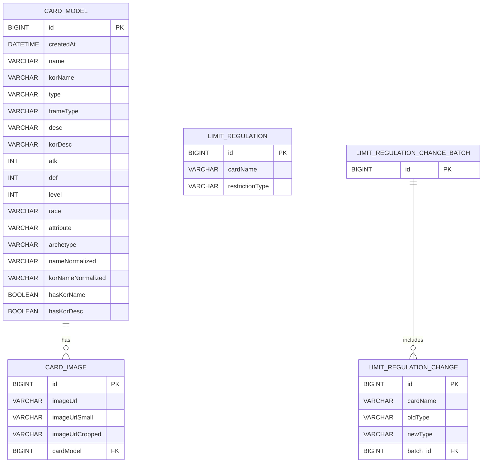

### YuGiOhDeck

## 이미지 학습 트리거

이미지 수집 완료를 학습 요청으로 연결하지 않습니다. `ImageService`는 이미지와
카드 메타데이터 수집을 담당하며, 학습 여부는 별도 AI worker의 continuous model
evaluation이 결정합니다. HTTP 예측 요청과 큐 worker에서 학습을 실행하지 않습니다.

`asbazq/yugioh-deck-ai`의 `continuous.run`은 정답 덱 스크린샷 100장 이상으로 운영
모델·평가셋·검색 벡터 변경 시 평가하고 기본 F1 0.95 미만이면 후보를 재학습합니다. 학습 간
24시간 cooldown과 중복 실행 잠금을 적용합니다. 수집한 `<id>.jpg`와 `id,type` CSV를
AI worker에 제공하되, 평가 스크린샷은 학습 데이터와 분리합니다.

설정은 AI 저장소의 `docs/continuous-evaluation.md`를 따릅니다. 검증을 통과한
후보의 `MODEL_PATH`를 AI 서비스에 반영하고 재시작하면 기존 Spring 예측 API 계약을
유지할 수 있습니다. teacher를 교체할 때는 student 재학습과 카드 벡터 재생성 및
임베딩 버전 동기화가 함께 필요합니다.

---

**유희왕 덱 구성 및 공유 플랫폼**

---

## 목차

1. [개요](#개요)
2. [기간](#기간)
3. [기술 스택](#기술-스택)
4. [주요 기능](#주요-기능)
5. [설치 및 실행](#설치-및-실행)
6. [URL 덱 공유](#url-덱-공유)
7. [검색 및 Full-Text](#검색-및-full-text)
8. [크롤링 및 스케줄링](#크롤링-및-스케줄링)
9. [금지/제한 리스트 크롤링](#금지제한-리스트-크롤링)
10. [이미지 처리 및 API](#이미지-처리-및-api)
11. [트러블 슈팅](#트러블-슈팅)
12. [대기열 처리](#대기열-처리)
13. [장기간 미사용 사용자 처리](#장기간-미사용-사용자-처리)
14. [모니터링 및 분석](#모니터링-및-분석)
15. [디자인](#디자인)

---

## 개요


* 기존 덱 공유 방식의 한계: 영어·스크린샷 위주로 카드 정보 확인이 어려움
* **목표**: 한글·영어 지원 검색, URL 공유, UX 개선을 통해 덱 구성 경험 최적화

## 기간

* 2024년 7월 20일 – 2024년 7월 24일

## 기술 스택

* **백엔드**: Spring Boot, MySQL
* **프론트엔드**: JavaScript, CSS (Tailwind)
* **스토리지**: 로컬
* **자동화**: Jsoup, Selenium
* **검색**: MySQL Full-Text (ngram parser)

---

## 주요 기능

* 카드 검색 (영어/한글) 및 정렬
* 덱 작성·관리 (좌클릭 추가, 우클릭 삭제)
* URL에 덱 상태를 압축·인코딩하여 공유
* 카드 3D 회전·빛 반사 효과, 클릭 확대
* 덱 초기화(리셋) 및 로딩 대기열 처리

---

## 설치 및 실행

1. 리포지토리 클론

   ```bash
   git clone <repo-url>
   ```
2. 백엔드 실행

   ```bash
   ./gradlew bootRun
   ```
3. 프론트엔드 실행

   ```bash
   cd front/my-app
   npm install && npm start
   ```

---

### 테스트

JDK 17을 설치하고 `JAVA_HOME`을 해당 JDK로 설정합니다.

```bash
bash ./gradlew test bootJar
cd front/my-app
npm ci
CI=true npm test -- --watchAll=false --runInBand
npm run build
```

백엔드 컨텍스트 테스트는 H2와 테스트용 설정을 사용하며, 정기 대기열 작업은 mock으로 대체합니다. 실제 MySQL·AI 서버 연결 검증은 별도로 필요합니다.

대기열 Lua 통합 테스트는 `YUGIOH_TEST_REDIS_PORT`가 설정되었을 때 실행됩니다. 테스트가 대기열 키를 초기화하므로 반드시 전용 임시 Redis를 사용합니다. 저장소 루트에서 실행하세요.

```bash
docker run --rm -d --name yugioh-redis-test -p 127.0.0.1:16379:6379 redis:7-alpine
YUGIOH_TEST_REDIS_PORT=16379 bash ./gradlew test --rerun-tasks
docker stop yugioh-redis-test
```

회귀 테스트는 설정 키 공유, heartbeat 후 퇴장 상태 유지, 빈 슬롯 보충, 카드 데이터 검증, 한글 정보 보조 조회, AI 요청 취소 및 대기열 상태 판정을 확인합니다. WebSocket 입력 검증·교체된 연결의 heartbeat 차단·동시 알림 전송 직렬화와 느린 대기 순서 조회의 중복·오래된 응답 차단도 검증합니다.

## URL 덱 공유

```js
const dataObj = { cards: cardsContent, extra: extraDeckContent };
const compressed = pako.deflate(JSON.stringify(dataObj), { to: 'string' });
const encoded = btoa(compressed);
window.history.pushState({}, '', `?deck=${encodeURIComponent(encoded)}`);
```

* `pako`로 압축, `btoa`로 Base64 인코딩
* 크롬(8,192자), IE(2,083자)까지 지원, 최대 \~75장 이미지 공유 가능

---

## 검색 및 Full-Text

* **표준 JPQL** (prefix only):

  ```java
  @Query("""
  SELECT c FROM CardModel c
  WHERE (:frameType = '' OR c.frameType = :frameType)
    AND (LOWER(REPLACE(c.korName,' ','')) LIKE CONCAT(:norm,'%')
      OR LOWER(REPLACE(c.name,' ','')) LIKE CONCAT(:norm,'%'))
  """
  Page<CardModel> searchByNameContaining(...);
  ```
* **ngram Full-Text** (중간 검색 지원):

  ```sql
  ALTER TABLE card_model
    ADD COLUMN name_normalized VARCHAR(255)
      GENERATED ALWAYS AS (LOWER(REPLACE(name,' ',''))) STORED,
    ADD COLUMN kor_name_normalized VARCHAR(255)
      GENERATED ALWAYS AS (LOWER(REPLACE(kor_name,' ',''))) STORED;

  ALTER TABLE card_model
    ADD FULLTEXT INDEX ft_idx_name_norm
      (name_normalized, kor_name_normalized)
      WITH PARSER ngram;
  ```

  ```java
  @Query(value = """
    SELECT * FROM card_model
    WHERE (:frameType = '' OR frame_type = :frameType)
      AND MATCH(name_normalized, kor_name_normalized)
          AGAINST(:query IN BOOLEAN MODE)
    """, nativeQuery = true)
  Page<CardModel> searchByFullText(...);
  ```

---

## 크롤링 및 스케줄링

* **Jsoup**: 일주일 간 추가된 카드 크롤링, 한글명 업데이트

  ```java
  String encodedName = encodeCardName(card.getName());
  String primaryUrl = "https://yugioh.fandom.com/wiki/" + encodedName;
  String fallbackUrl = "https://yugipedia.com/wiki/"   + encodedName;

  Document doc = fetchDoc(primaryUrl);
  Document spareDoc = fetchDoc(fallbackUrl);

  // 이름 추출
  String korName = extractKorName(doc, spareDoc);
  if (korName != null) {
      card.setKorName(korName);
  } else {
      log.info("한국어 이름을 찾을 수 없습니다: {}", card.getName());
  }
  ```
* **스케줄 설정**: 매일/주기적으로 크롤링 스케줄러 등록

---

## 금지/제한 리스트 크롤링

* **Selenium**: Master Duel 리스트 추출

  ```java
  WebDriverWait wait = new WebDriverWait(driver, Duration.ofSeconds(10));
  WebElement banlistTypeElement = wait.until(ExpectedConditions.visibilityOfElementLocated(By.id("banlisttype")));
  // 'banlisttype'을 'Master Duel'로 설정
  Select banlistTypeSelect = new Select(banlistTypeElement);
  banlistTypeSelect.selectByValue("Master Duel");

  // 'banlistdate'를 최신 날짜로 설정
  WebElement banlistDateElement = wait.until(ExpectedConditions.visibilityOfElementLocated(By.id("banlistdate")));
  Select banlistDateSelect = new Select(banlistDateElement);
  banlistDateSelect.selectByIndex(0);  // 최신 항목을 선택

  // 'textView' 버튼 클릭
  WebElement textView = wait.until(ExpectedConditions.elementToBeClickable(By.id("textButton")));
  textView.click();

  ```

---

## 이미지 처리 및 API

* 외부 API에서 카드 이미지 수집, 로컬서버 저장
* 로컬 캐시 서버로 속도 최적화
* REST endpoint 제공

  ```java
      @GetMapping("/images/{filename}")
      public ResponseEntity<Resource> getImage(@PathVariable("filename") String filename) {
          try {
              Path imagePath = savePath.resolve(filename);
              Resource resource = new UrlResource(imagePath.toUri());

              if (resource.exists() || resource.isReadable()) {
                  return ResponseEntity.ok()
                      .header(HttpHeaders.CONTENT_DISPOSITION, "inline; filename=\"" + resource.getFilename() + "\"")
                      .body(resource);
              } else {
                  return ResponseEntity.notFound().build();
              }
          } catch(MalformedURLException e) {
              return ResponseEntity.badRequest().build();
          }
      }
  ```

---

## 대기열 처리

* zset으로 대기열을 구축
* 접속 유저 leave 시 자동으로 승급
* 접속 방치 유저 자동 퇴출
* score 별로 차등을 주어 우선 순위 줌

```java
    private void promoteNextUser(String qid) {
        String runKey  = RUNNING_PREFIX + qid;
        String vipKey  = WAITING_PREFIX + "vip";
        String mainKey = WAITING_PREFIX + "main";
        if (totalRunningSize() >= maxRunning()) return;

        TypedTuple<String> vipTuple  = firstWithScore(vipKey);
        TypedTuple<String> mainTuple = firstWithScore(mainKey);

        if (vipTuple == null && mainTuple == null) return;

        double vipScore  = vipTuple  == null ? Double.MAX_VALUE : vipTuple.getScore() - VIP_PRIORITY_BONUS;
        double mainScore = mainTuple == null ? Double.MAX_VALUE : mainTuple.getScore();

        String uid = "";
        boolean isVip = false;
        if (vipScore <= mainScore) {
            uid = vipTuple.getValue();
            isVip = true;
        } else {
            uid = mainTuple.getValue();
            isVip = false;
        }

        if (isVip) redis.opsForZSet().remove(vipKey, uid);
        else redis.opsForZSet().remove(mainKey, uid);

        redis.opsForZSet().add(runKey, uid, Instant.now().toEpochMilli());
        notifier.sendToUser(uid, "{\"type\":\"ENTER\"}");
    }
```
---


## 장기간 미사용 사용자 처리

* **TTL 설정:** Redis Sorted Set의 각 사용자 엔트리마다 score로 타임스탬프를 저장하고, `EXPIRE`를 걸어 세션 만료 시 자동 삭제
* **비활성 사용자 제어 로직:**

  1. `@Scheduled` 어노테이션을 사용하여 10초 주기로 모든 RUNNING ZSet 점검
  2. 현재 시각 기준으로 TTL (예: 5분) 초과 사용자를 검색 후 제거
  3. 세션 만료 사용자에게 WebSocket으로 `TIMEOUT` 메시지 전송 후 RUNNING ZSet에서 제거

```java
long cutoff = System.currentTimeMillis() - sessionTtlMillis();
Set<String> expired = redis.opsForZSet().rangeByScore(runKey, 0, cutoff);
expired.forEach(uid -> notifier.sendToUser(uid, "{\"type\":\"TIMEOUT\"}"));
```

* **Client 측 heartbeat 처리:**

  * React에서 `useCallback`으로 ping 메시지를 주기적으로 서버에 전송하여 세션 유지

```tsx
const sendPing = useCallback(() => {
    if (wsRef.current && wsRef.current.readyState === WebSocket.OPEN) {
      wsRef.current.send('PING');
    }
}, []);
```

## 트러블 슈팅

### ❗ 전역 WebDriver + @PostConstruct 초기화 문제

```text
java.lang.NullPointerException: Cannot invoke "org.openqa.selenium.WebDriver.get(String)" because "driver" is null
```

### 📌 원인

* `WebDriver`를 **전역 필드로 선언**하고 `@PostConstruct`에서 초기화했지만,
  이후정: 매번 새로 생성

```java
public WebDriver setup() {
    ChromeOptions options = new ChromeOptions();
    options.setBinary(System.getenv("WEB_DRIVER_CHROME_BIN"));
    options.addArguments("--headless", "--no-sandbox", "--disable-dev-shm-usage");
    return new ChromeDriver(options);
}

public void runCrawl() {
    WebDriver driver = setup();
    try {
        driver.get("https://example.com");
        ...
    } finally {
        driver.quit();
    }
}
```

> 💡 `WebDriver`는 재사용하지 말고, 작업마다 새로 생성하고 종료하는 구조로 변경하세요.

---


### ❗ 동기식 API 호출과 크롤링 중 서버 부하 문제

### 📌 증상

* API 호출과 카드 이미지 크롤링을 동기 방식으로 처리하는데도 작업 중 서버와 컴퓨터가 느려졌다.
* 이미지를 순차적으로 다운로드하면 하나의 요청이 완료될 때까지 다음 요청이 대기하여 전체 처리 시간도 길어졌다.

### 📌 원인

* 동기 처리는 한 번에 하나의 작업을 기다린다는 뜻이지, CPU·네트워크·디스크 자원을 적게 사용한다는 뜻은 아니다.
* 반복문이 지연 없이 외부 API와 이미지 서버에 연속적으로 요청을 보내면, 호출 스레드가 계속 블로킹되고 연결·응답·파일 저장 작업이 집중된다.
* 요청 간격이 없으면 대상 서버에서 `429 Too Many Requests`나 일시적인 네트워크 오류가 발생할 수 있고, 재시도가 더해져 오히려 전체 부하와 처리 시간이 늘어난다.

### 📌 해결

* 이미지 다운로드 작업을 `ExecutorService`의 고정 크기 스레드 풀에 분리해 여러 네트워크 I/O를 동시에 처리했다.
* 이미지 다운로드 스레드 수를 최대 2개로 제한해 작업 개수만큼 스레드가 무제한으로 생성되지 않도록 했다.
* 모든 워커가 공유하는 요청 속도 제한기에 `Thread.sleep()`을 적용해, 새 HTTP 요청의 시작 간격을 최소 250ms로 유지했다.
* `429` 응답이나 일시적인 실패가 발생하면 지수 백오프로 재시도 간격을 늘려 대상 서버와 자체 서버의 부하를 조절했다.
* 크롤링 중 애플리케이션 컨테이너가 호스트 CPU를 과도하게 점유하지 않도록 Docker CPU 사용량을 0.75코어로 제한했다.

```java
ExecutorService executor = Executors.newFixedThreadPool(2);
List<Future<Path>> futures = executor.invokeAll(jobs);

long waitMs = nextRequestAtMillis - System.currentTimeMillis();
if (waitMs > 0) {
    Thread.sleep(waitMs);
}
nextRequestAtMillis = System.currentTimeMillis() + 250L;
```

> 💡 현재 구조는 HTTP API가 즉시 응답하는 완전한 비동기 방식은 아니다. API 요청 스레드는 `invokeAll()`에서 전체 완료를 기다리지만, 실제 다운로드는 별도 워커에서 병렬 처리된다. `sleep`은 성능 향상용이 아니라 요청을 의도적으로 지연시켜 순간 부하와 요청 실패를 줄이는 속도 제한 장치다.

실행 중인 컨테이너에는 다음과 같이 CPU 제한을 적용했다.

```bash
docker update --cpus="0.75" yugioh-app
docker stats yugioh-app
```

`--cpus="0.75"`는 호스트 전체 CPU의 75%가 아니라 CPU 0.75코어 분량을 의미한다. 서버 전체 코어 용량의 75%로 제한하려면 `nproc`으로 코어 수를 확인한 뒤 해당 값에 0.75를 곱한다. 예를 들어 4코어 서버에서는 `--cpus="3"`을 사용한다.

컨테이너가 다시 생성되어도 제한을 유지하려면 Compose의 `app` 서비스에 설정한다.

```yaml
services:
  app:
    cpus: 0.75
```

### 📌 결과

* 네트워크 대기 시간이 서로 겹쳐져 순차 처리보다 전체 다운로드 시간을 단축했다.
* 동시성과 요청 시작 속도에 상한을 두어 CPU, 네트워크, 파일 I/O가 순간적으로 몰리는 현상을 완화했다.
* 외부 서버의 요청 제한을 존중하여 `429`, 타임아웃, 불필요한 재시도 가능성을 줄였다.
* 컨테이너의 CPU 상한을 설정해 크롤링 중에도 호스트의 다른 프로세스가 사용할 CPU 여유를 확보했다.

---

### ❗ 카드 검색 전체 결과 수 집계로 인한 지연

### 📌 증상

* 카드 검색 결과를 페이지 단위로 조회할 때 목록 조회 외에 전체 검색 결과 수를 계산하는 쿼리가 함께 실행됐다.
* 검색 조건이 많아질수록 목록 자체는 일부만 가져오더라도 전체 결과 수 계산을 위해 검색 대상 전체를 다시 검사할 수 있었다.

### 📌 원인

기존 검색 API와 Repository는 Spring Data JPA의 `Page`를 반환했다.

```java
Page<CardModel> searchByFullText(..., Pageable pageable);
```

`Page`는 `totalElements`와 `totalPages`를 제공해야 하므로 일반적으로 다음 두 종류의 쿼리를 수행한다.

```sql
-- 현재 페이지 데이터 조회
SELECT ...
FROM card_model
WHERE ...
LIMIT ?, ?;

-- 전체 검색 결과 수 조회
SELECT COUNT(*)
FROM card_model
WHERE ...;
```

카드 검색 조건에는 `MATCH ... AGAINST`뿐 아니라 다음과 같은 부분 문자열 검색도 포함된다.

```sql
LOWER(name) LIKE LOWER(CONCAT('%', :raw, '%'))
LOWER(kor_name) LIKE LOWER(CONCAT('%', :raw, '%'))
```

앞에 `%`가 붙는 부분 문자열 검색과 컬럼에 적용된 `LOWER()` 함수는 일반 B-Tree 인덱스를 활용하기 어렵다. 따라서 전체 결과 수를 계산하는 `COUNT(*)`도 검색 데이터가 증가할수록 비용이 커질 수 있다.

반면 프론트엔드는 전체 결과 수인 `totalElements`나 전체 페이지 수인 `totalPages`를 사용하지 않고 다음 값만 사용하고 있었다.

* `content`: 현재 페이지의 검색 결과
* `number`: 현재 페이지 번호
* `last`: 마지막 페이지 여부

즉, 화면에는 정확한 전체 검색 결과 수가 필요하지 않고 다음 페이지 존재 여부만 필요했다.

### 📌 해결

검색 API, Service, Repository의 반환 타입을 `Page`에서 `Slice`로 변경했다.

```java
Slice<CardModel> searchByFullText(
    String query,
    String frameType,
    String raw,
    Pageable pageable
);
```

`Slice`는 전체 결과 수를 계산하지 않고 요청한 페이지 크기보다 한 건을 더 조회해 다음 페이지 존재 여부를 판단한다.

```text
size=20 요청
→ 최대 21건 조회
→ 21번째 결과가 있으면 hasNext=true, last=false
→ 별도의 전체 COUNT 쿼리 없음
```

컨트롤러와 서비스도 동일하게 `Slice<CardMiniDto>`를 반환하도록 변경했다.

```java
public Slice<CardMiniDto> search(
        String keyWord,
        String frameType,
        Pageable pageable) {
    Slice<CardModel> cards = cardRepository.searchByFullText(...);
    return cards.map(cardModel -> {
        // 이미지와 제한 정보를 CardMiniDto로 변환
        return new CardMiniDto(...);
    });
}
```

### 📌 결과

* 카드 검색 요청마다 실행되던 전체 결과 수 집계를 제거했다.
* 검색 데이터가 증가해도 사용하지 않는 `COUNT(*)` 때문에 응답 시간이 늘어나는 문제를 방지했다.
* 기존 프론트에서 사용하는 `content`, `number`, `last` 응답 필드는 유지되어 무한 스크롤 로직을 변경하지 않아도 된다.
* 정확한 전체 검색 결과 수는 더 이상 응답하지 않으며, 향후 화면에서 전체 개수가 필요해지면 별도 집계 전략을 다시 검토해야 한다.

### 📌 검증

```bash
./gradlew.bat -q classes
```

백엔드 컴파일을 통과했으며 `Page`에 의존하던 카드 검색 계층을 모두 `Slice`로 변경했다.

---

## 모니터링 및 분석

* **Google Analytics**: 사용자 행동 분석
* 덱 구성 빈도, 인기 카드 트렌드 추적
* UI/UX 개선 인사이트 수집

---
# erd


```mermaid
erDiagram
  CARD_MODEL {
    BIGINT id PK
    DATETIME createdAt
    VARCHAR name
    VARCHAR korName
    VARCHAR type
    VARCHAR frameType
    VARCHAR desc
    VARCHAR korDesc
    INT atk
    INT def
    INT level
    VARCHAR race
    VARCHAR attribute
    VARCHAR archetype
    VARCHAR nameNormalized
    VARCHAR korNameNormalized
    BOOLEAN hasKorName
    BOOLEAN hasKorDesc
  }

  CARD_IMAGE {
    BIGINT id PK
    VARCHAR imageUrl
    VARCHAR imageUrlSmall
    VARCHAR imageUrlCropped
    BIGINT cardModel FK
  }

  LIMIT_REGULATION {
    BIGINT id PK
    VARCHAR cardName
    VARCHAR restrictionType
  }

  LIMIT_REGULATION_CHANGE_BATCH {
    BIGINT id PK
  }

  LIMIT_REGULATION_CHANGE {
    BIGINT id PK
    VARCHAR cardName
    VARCHAR oldType
    VARCHAR newType
    BIGINT batch_id FK
  }

  CARD_MODEL ||--o{ CARD_IMAGE : has
  LIMIT_REGULATION_CHANGE_BATCH ||--o{ LIMIT_REGULATION_CHANGE : includes

```

---

## 디자인


---


## Queue Patch Notes (2026-04-03)

대기열 Redis/WebSocket 처리에서 운영 중 문제될 수 있는 부분을 보완했다.

### 수정 내용

* WebSocket 재연결 시 이전 세션 종료가 곧바로 `leave()`로 이어지지 않도록 수정
* 동일 `userId`가 `vip`와 `main` running queue에 동시에 들어가지 못하도록 수정
* `leave()` 시 특정 qid만 지우지 않고 group 내 running/waiting membership을 함께 정리하도록 수정
* PING 갱신 시 현재 qid만 갱신하지 않고 실제 running 상태인 queue를 모두 갱신하도록 수정
* TTL 만료 스케줄러의 승급 로직에 `vip_streak` 제한을 반영해서 일반 승급과 동일한 공정성 규칙을 적용
* `/queue` API에서 `group`, `qid`, `userId`를 검증해서 잘못된 queue key가 Redis에 생기지 않도록 수정

### 수정 파일

* `src/main/java/com/card/Yugioh/security/QueueWebSocketHandler.java`
* `src/main/java/com/card/Yugioh/service/QueueService.java`
* `src/main/java/com/card/Yugioh/service/QueueJobService.java`
* `src/main/java/com/card/Yugioh/controller/QueueController.java`

### 기대 효과

* 브라우저 새로고침이나 일시적 재연결로 사용자가 대기열에서 잘못 이탈하는 문제 방지
* 동일 사용자 중복 입장으로 인한 running slot 오염 방지
* TTL 만료와 일반 퇴장 모두에서 일관된 승급 순서 유지
* 비정상 파라미터로 Redis key space가 오염되는 문제 방지

---

## Project Update Notes (2026-04-03)

이번 수정은 화면 완성도, 운영 안정성, 테스트 재현성, 정적 리소스 처리 효율을 함께 보완하는 방향으로 진행했다.

### 1. Frontend UI 정리

#### 왜 변경했는가

기존 프론트는 메인 화면, 사이드 메뉴, 관리자 페이지의 톤이 서로 달랐고, 일부 기능 버튼이 사라지거나 라우팅이 깨져 실제로 접근이 되지 않는 문제가 있었다. 또한 관리자 페이지와 AI 판별 모달에는 깨진 문자열과 급하게 붙인 상태 관리 코드가 남아 있어 유지보수가 어려웠다.

#### 무엇을 변경했는가

* 메인 덱 빌더 화면 레이아웃을 재구성하고 검색, 카드 상세, 덱 섹션, 공유 흐름을 다시 정리했다.
* `Limit Regulation`, `Queue Admin`, `AI 카드 판별` 버튼을 다시 연결했다.
* 관리자 페이지가 Router 밖에서 렌더링되던 문제를 수정해 실제로 페이지가 뜨도록 고쳤다.
* 사이드 메뉴와 관리자 페이지 스타일을 메인 화면과 같은 톤으로 통일했다.
* `AICardRecognizerModal.jsx`, `LimitBoard.jsx`를 정리해 깨진 문자열과 hook dependency 경고를 제거했다.

#### 무엇을 사용했고 왜 그걸 사용했는가

* React 상태 기반 렌더링을 유지했다.
  이유: 현재 프로젝트 구조를 크게 뒤엎지 않고도 화면 흐름을 안정적으로 복구할 수 있기 때문이다.
* 공용 CSS 파일을 정리하는 방식으로 스타일을 통일했다.
  이유: 디자인 시스템을 새로 도입하는 것보다 현재 규모에서는 유지비용이 낮고 적용 속도가 빠르기 때문이다.
* `useCallback`, `useRef`, effect 분리를 사용해 AI 모달 로직을 재구성했다.
  이유: WebSocket, polling, timeout, 업로드 상태가 섞인 컴포넌트에서 stale closure와 재실행 문제를 줄이기 위해서다.

#### 수정 파일

* `front/my-app/src/App.js`
* `front/my-app/src/App.css`
* `front/my-app/src/index.js`
* `front/my-app/src/QueueAdminPage.jsx`
* `front/my-app/src/styles/Menu.css`
* `front/my-app/src/styles/QueueAdminPage.css`
* `front/my-app/src/components/LimitPage.jsx`
* `front/my-app/src/components/AICardRecognizerModal.jsx`
* `front/my-app/src/components/LimitBoard.jsx`

### 2. Queue 안정성 보완

#### 왜 변경했는가

Redis + WebSocket 기반 대기열 구조 자체는 맞았지만, 재연결 시 잘못된 `leave()` 처리, `vip/main` 중복 running 진입, 만료 승급 규칙 불일치 같은 운영 장애 포인트가 있었다. 이런 문제는 실제 접속자가 늘면 순서 꼬임과 예기치 않은 이탈로 바로 드러난다.

#### 무엇을 변경했는가

* 재연결 시 이전 소켓 종료가 현재 활성 세션이 아닐 경우 큐 이탈로 이어지지 않도록 수정했다.
* 동일 사용자가 `vip`와 `main` running queue에 동시에 들어가지 못하도록 막았다.
* `leave()`와 `touch()`가 특정 qid만 보지 않고 group 전체 membership 기준으로 동작하도록 정리했다.
* TTL 만료 시 승급 로직에도 `vip_streak` 제한을 반영해 일반 승급 규칙과 일치시켰다.
* `/queue` API 입력값을 검증해 잘못된 queue key가 Redis에 생기지 않도록 했다.

#### 무엇을 사용했고 왜 그걸 사용했는가

* Redis Lua script를 유지하면서 보완했다.
  이유: queue 진입, 이탈, 승급은 원자성이 중요하고, 기존 구조를 살리면서 race condition을 가장 적게 만들 수 있기 때문이다.
* WebSocket 세션 맵에서 compare-and-remove 방식으로 현재 활성 세션만 정리하도록 바꿨다.
  이유: 브라우저 새로고침이나 일시적 재연결을 정상 흐름으로 처리하려면 "닫힌 세션이 최신 세션인가"를 구분해야 하기 때문이다.

#### 수정 파일

* `src/main/java/com/card/Yugioh/security/QueueWebSocketHandler.java`
* `src/main/java/com/card/Yugioh/service/QueueService.java`
* `src/main/java/com/card/Yugioh/service/QueueJobService.java`
* `src/main/java/com/card/Yugioh/controller/QueueController.java`

### 3. 보안, 설정, 테스트 정리

#### 왜 변경했는가

운영 자격증명이 코드와 설정 파일에 섞여 있으면 배포 환경 분리와 보안 관리가 어렵다. 또한 테스트가 외부 MySQL 환경에 직접 묶여 있으면 로컬과 CI에서 쉽게 깨지고, 코드 변경 검증 속도도 떨어진다.

#### 무엇을 변경했는가

* 관리자 계정을 하드코딩하지 않고 환경변수 기반 설정으로 이동했다.
* 애플리케이션 설정에서 DB, 이미지 경로, AI 서버 주소를 환경변수 기반으로 정리했다.
* 테스트 프로파일을 분리하고 H2 메모리 DB를 사용하도록 바꿨다.
* `ImageService`에서 컨트롤러 역할이 섞여 있던 애노테이션을 서비스 역할에 맞게 정리했다.

#### 무엇을 사용했고 왜 그걸 사용했는가

* Spring 환경변수 placeholder 방식을 사용했다.
  이유: 배포 환경마다 값을 바꿔야 하는 설정을 코드 수정 없이 주입할 수 있기 때문이다.
* 테스트는 H2 메모리 DB를 사용했다.
  이유: 지금 단계에서는 Testcontainers보다 설정이 가볍고, `./gradlew test`를 로컬에서 바로 재현하기 쉽기 때문이다.
* 정적 이미지는 `@GetMapping` 대신 `ResourceHandler`로 연결했다.
  이유: 이미지에는 비즈니스 로직이 없고, 서블릿 컨테이너가 직접 서빙하는 편이 Controller/Service를 거치는 것보다 단순하고 효율적이기 때문이다.

#### 수정 파일

* `src/main/java/com/card/Yugioh/security/SecurityConfig.java`
* `src/main/resources/application.properties`
* `src/test/java/com/card/Yugioh/YugiohApplicationTests.java`
* `src/test/resources/application-test.properties`
* `src/main/java/com/card/Yugioh/service/ImageService.java`

### 4. 검증

* Frontend: `npm run build`
* Backend: `./gradlew test`

### 5. Docker Compose + FastAPI 연동

`docker-compose.yml`은 이제 Spring, MySQL, Redis와 함께 `E:\Project\yugioh-deck-ai`의 FastAPI 서버도 같이 올리도록 구성되어 있다.

#### 추가된 구성

* `ai` 서비스가 `../yugioh-deck-ai/Dockerfile`로 빌드된다.
* Spring `app` 서비스는 `AI_PREDICT_BASE_URL=http://ai:8000`을 사용해 FastAPI 컨테이너에 내부 네트워크로 연결된다.
* `app` 서비스는 `ai` 헬스체크가 통과한 뒤 시작된다.
* Chroma 데이터는 `ai-chroma` 볼륨을 사용하고, 스냅샷은 `../yugioh-deck-ai/snapshots`를 읽기 전용으로 마운트한다.

#### 실행 방법

```bash
cd E:/Project/Yugioh
docker compose up -d --build
```

#### 확인 포인트

* FastAPI 외부 포트: `8000`
* Spring 내부 AI 주소: `http://ai:8000`
* compose 문법 검증:

```bash
docker compose -f E:/Project/Yugioh/docker-compose.yml config
```

#### 주의 사항

* 현재 `app`, `crawler`의 이미지 볼륨 경로는 `/home/d568/...` 기준이다.
* Linux 서버 배포 기준이면 그대로 사용하면 되고, Windows 로컬에서 직접 실행할 경우 해당 bind mount 경로는 로컬 환경에 맞게 바꿔야 한다.

두 검증 모두 2026-04-03 기준으로 통과했다.


## 검색 결과 무한스크롤 중복

### 증상

```text
검색 결과를 스크롤해 다음 페이지를 불러올 때 같은 카드가 다시 섞여 보임
```

### 원인

- 백엔드 검색 쿼리가 점수 기반 정렬만 사용하고 마지막 tie-breaker가 없어서, 점수가 같은 카드가 페이지 경계에서 다시 섞일 수 있었다.
- 프론트는 다음 페이지 응답을 그대로 append 하고 있어서, 서버가 같은 카드를 다시 내려주면 중복이 그대로 쌓였다.
- `IntersectionObserver`가 같은 검색어와 페이지 조합을 다시 요청해도 막지 않아, 스크롤 타이밍에 따라 같은 페이지가 중복 요청될 수 있었다.

### 수정

- 검색 SQL `ORDER BY` 마지막에 `id ASC`를 추가해 페이지네이션 기준을 고정했다.
- 프론트 검색 결과 병합 시 `id`, `imageUrl`, `name` 순서로 식별 키를 만들어 dedupe 하도록 변경했다.
- 이미 요청한 `검색어:페이지` 조합은 다시 요청하지 않도록 막았다.
- 검색 결과 렌더 key에서 `index` 의존을 제거해 목록 식별을 안정화했다.


---

## 대기열 상태 동기화 수정 (2026-07-30)

Redis 대기 인원이 0명인데도 브라우저에 이전 대기 순번이 남는 문제를 수정했다. 서버가 WebSocket 연결 직후 사용자의 실제 Redis 상태를 다시 확인하고, 전체 대기열 통계와 사용자별 상태 메시지를 명확히 구분하도록 변경했다.

### 변경 내용

* 클라이언트가 `joinQueue` 메시지를 보내면 WebSocket 세션에 `userId`를 저장한다.
* Redis 상태를 확인해 사용자에게 다음 메시지 중 하나만 반환한다.
  * Waiting 상태: `position`
  * Running 상태: `redirect`
  * Waiting과 Running 어디에도 없는 상태: `queueEmpty`
* 대기열에 없는 사용자의 `position`이 `null`일 때 숫자 포맷 예외가 발생하지 않도록 분기 처리했다.
* `position`과 `redirect` 메시지는 전체 브로드캐스트하지 않고 해당 `userId`의 열린 WebSocket 세션에만 전송한다.
* 사용자가 Waiting에서 Running으로 이동하면 남은 대기 사용자들의 Redis `ZRANK`를 다시 조회해 최신 순번을 전송한다.
* 전체 대기열 상태 메시지에 `"action": "queueStatus"`를 추가했다.
* 전체 상태 메시지는 `session.isOpen()`으로 연결 상태를 확인한 후 전송한다.
* `GET /api/queue/checkStatus`는 `WAITING`, `RUNNING`, `NOT_FOUND` 중 하나를 `status` 필드로 반환한다.
* `POST /api/queue/broadcastPosition`도 지정된 사용자에게만 현재 순번을 전송한다.

### WebSocket 메시지 예시

```json
{
  "action": "queueStatus",
  "waiting": 0,
  "running": 0,
  "finished": 0
}
```

```json
{
  "action": "queueEmpty",
  "userId": "user_xxx"
}
```

### 포트 변경

Spring 애플리케이션 포트를 `8082`에서 `8043`으로 변경했다.

* Spring 기본 포트: `8043`
* Docker 포트: `443:8043`, `8043:8043`
* nginx upstream: `app:8043`
* 프론트 AI WebSocket 운영 주소: `no86.xyz:8043`
* CORS 운영 주소: `https://no86.xyz:8043`

### 수정 파일

* `src/main/java/com/card/Yugioh/webSocket/QueueWebSocketHandler.java`
* `src/main/java/com/card/Yugioh/service/JobService.java`
* `src/main/java/com/card/Yugioh/controller/WebAPIController.java`
* `src/main/resources/application.properties`
* `front/my-app/src/components/AICardRecognizerModal.jsx`
* `nginx/nginx.conf`
* `docker-compose.yml`

요청서에 언급된 `WaitingRoomPage.html`은 현재 저장소에 존재하지 않는다. 현행 React 대기 화면은 `front/my-app/src/components/QueueApp.jsx`와 `QueueModal.jsx`가 담당한다.

### 검증

```bash
./gradlew.bat -q classes
cd front/my-app
npm run build
```

백엔드 컴파일과 프론트 프로덕션 빌드가 완료됐다. 프론트 빌드에는 기존 ESLint 경고가 남아 있지만 이번 변경으로 발생한 컴파일 오류는 없다.

## 미번역·미출시 카드 수집

불안정한 유출본을 피하기 위해 최신 20개를 제외하고(`offset=20`) 영문 정보를 저장합니다. 수집은 기본 매주 월요일 03:00
(Asia/Seoul)이며 `card.ingestion.cron`으로 변경할 수 있습니다. 한국어 수집은 기존
수요일 스케줄에서 재확인 시점이 된 번역 대기 카드를 최대 100개 확인하므로 최신 200개 범위를
벗어나도 번역 대기 카드가 잊히지 않습니다.

- `PENDING`: 한국어 이름·설명 모두 없음. 정상적인 대기 상태입니다.
- `PARTIAL`: 이름·설명 중 일부만 있음. 다음 재확인 시점에 빠진 필드를 확인합니다.
- `READY`: 이름·설명이 모두 있음.

번역 상태는 실제 저장된 문자열에서 계산합니다. 한국어 이름이 없거나 공백이면
검색·카드 상세·AI 후보에서 제외합니다. 한국어 이름만 있으면 표시할 수 있으며,
설명은 기존 영문 fallback을 유지합니다. 기존 카드 정보 갱신은 한국어 번역과
관리자의 출시 상태를 보존합니다. 카드/이미지 메타데이터와 번역 저장은 카드별
독립 트랜잭션으로 수행해 하나의 잘못된 카드가 다른 카드의 저장을 취소하지 않습니다.
전체 카드가 실패하면 수집 API도 실패를 반환하고, 일부 실패는 로그에 남기며
`processed`에는 저장 성공 카드 수만 반환합니다.

출시 상태는 별도 `korean_release_status` 필드로 `UNKNOWN`, `UNRELEASED`, `RELEASED`를
관리합니다. 번역이 있다고 한국 정식 출시로 판정하지 않습니다. 현재 API·번역
크롤러는 한국 출시를 확정할 근거가 없으므로 자동 판정하지 않습니다.
`UNKNOWN`은 기존 동작과의 호환을 위해 한국어 이름이 있으면 노출되며,
명시적 `UNRELEASED`는 번역이 있어도 숨깁니다. 이 조건은 한국어 카드 검색·상세·AI
후보에 적용되며, 금지·제한 공지의 원문 카드명은 그대로 유지합니다.

관리자 인증이 필요한 API:

- `GET /api/admin/queue/cards/translation-pending?page=0&size=20`: 번역 대기/부분 완료 목록.
- `PATCH /api/admin/queue/cards/{id}/korean-release?status=UNRELEASED`: 출시 근거에 따른 상태 지정.
- `POST /api/admin/queue/fetchKorData`: 재확인 시점이 된 번역 대기 카드 처리.

**배포 전:** 자동 스키마 갱신을 사용하지 않는 DB는
`sql/20260916-korean-card-availability.sql`을 먼저 1회 적용해야 합니다.
이미지·영문 원본 수집과 모델 재학습은 독립적이며 미번역 카드 수집 자체는 학습
트리거가 아닙니다.


## 개인 로컬 서버용 리소스 정책

- 수집은 월요일 03:00 주 1회 `checkDBVer.php`로 시작합니다. 버전·요청 URL이 같고
  이전 작업이 완료되었다면 카드 API, 카드 DB 조회 및 이미지 다운로드를 생략합니다.
  최초 확인한 버전은 upstream JSON의 최대 48시간 캐시를 고려해 이후 스케줄에서
  한 번 더 확인합니다. 버전 API 오류 시 전체 다운로드로 우회하지 않습니다.
- `<card.image.save-path>/.ingestion-state.json`에 받은 JSON과 성공 여부를 원자적으로
  저장합니다. 부분 실패는 버전이 같아도 저장된 응답으로 재시도합니다. 이 상태 파일과
  이미지·DB는 함께 보존해야 합니다. 복구 후 파일/DB만 달라졌다면 관리자 수동 수집
  (`fetchApiData`)을 실행하거나 상태 파일을 제거해 다시 검사합니다.
- 바뀌지 않은 카드와 이미지 메타데이터는 UPDATE하지 않습니다. 이미지는 없는 파일만
  받습니다. `card.image.download-concurrency` 기본값은 2이며 1~2로 제한합니다.
- 번역 작업은 `card.translation.concurrency=1`, `card.translation.batch-size=100`이
  기본입니다. 번역이 없으면 1→2→4→8주(최대)로 간격을 늘립니다. 부분 번역의 진척이나
  영문 원본 변경 시 지연을 줄이거나 초기화합니다. 대기 상태 조회는 계속 가능합니다.
- 수집 후 작은 이미지 폴더에 `catalog.csv`를 생성합니다(`id,card_id,name,type`).
  추가 쿼리 없이 이미지를 찾을 수 있도록 이미지 ID와 부모 카드 ID를 구분합니다.
  이 폴더를 AI worker에 공유하고 `CATALOG_CSV`를 해당 파일로 지정합니다.
- 추가 DB 변경은 `sql/20260916-local-resource-policy.sql`에 있습니다.
  자동 스키마 갱신을 쓰지 않는 환경은 이전 출시 상태 migration 이후 적용합니다.

AI worker는 목요일 03:00 주 1회 깨어나 새/수정된 이미지의 벡터만 생성합니다.
변경이 없으면 TensorFlow를 로드하지 않고 평가·재학습도 생략합니다.
