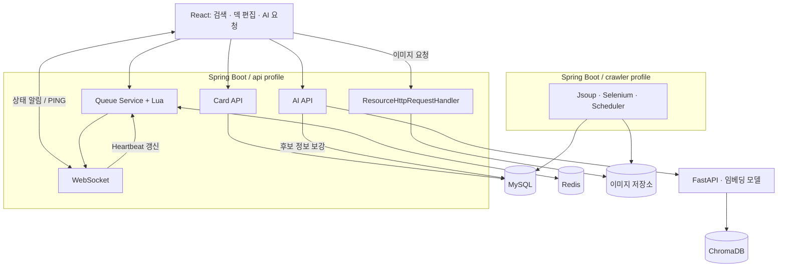
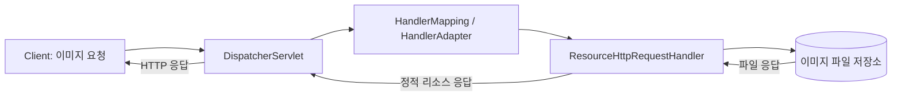
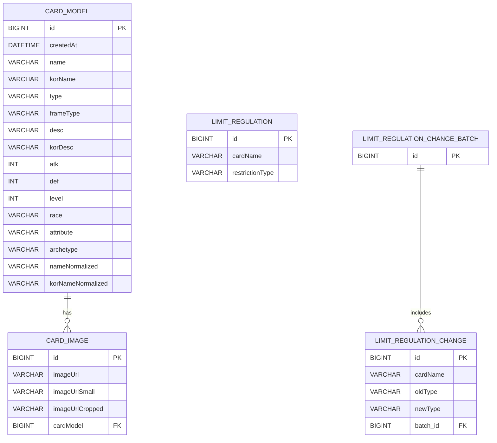

# YuGiOhDeck

**한글·영문 카드 검색과 URL 덱 공유를 제공하는 유희왕 덱 구성 플랫폼**

영어 카드명과 스크린샷 중심의 공유 방식에서는 카드 정보를 확인하고 같은 덱을 다시 구성하는 과정이 번거로웠습니다. 이를 줄이기 위해 카드 검색, 덱 편집, URL 공유, 이미지 기반 카드 판별 기능을 구현했습니다.

운영 과정에서는 **순간 트래픽의 입장 제어**, **정적 이미지 처리 경로 분리**, **검색 결과의 일관성**을 중심으로 개선했습니다.

- **개발 기간:** 2024.07.20 ~ 2025.08.24
- **이후:** 유지보수 및 기능 개선
- **관련 프로젝트:** [QueueSystem](https://github.com/asbazq/queueSystem) · [AI 카드 판별](https://github.com/asbazq/yugioh-deck-ai)


## 목차

- [주요 기능](#features)
- [기술 스택과 구조](#architecture)
- [대기열 설계와 개선](#queue)
- [이미지 처리 및 정적 리소스 최적화](#images)
- [카드 검색과 덱 공유](#search-and-share)
- [데이터 수집과 실행 환경 분리](#ingestion)
- [AI 카드 판별](#ai)
- [측정 기록과 해석](#measurements)
- [테스트](#tests)
- [운영 상세](#operations)
- [데이터 구조와 화면](#screens)

<a id="features"></a>
## 주요 기능

| 기능 | 사용자에게 제공하는 동작 |
|---|---|
| 카드 검색 | 한글·영문 이름 검색, 카드 종류별 필터링, 무한 스크롤 |
| 덱 편집·공유 | 메인·엑스트라 덱 구성, URL로 동일한 덱 복원 |
| AI 카드 판별 | 업로드한 이미지에서 카드 후보를 찾고 한글 정보 제공 |
| 실시간 대기열 | 서비스·AI 기능별 동시 이용 인원 제어와 개인별 상태 알림 |
| 카드 데이터 수집 | 카드 정보와 금지·제한 목록 갱신, 번역·출시 상태 관리 |

<a id="architecture"></a>
## 기술 스택과 구조

| 영역 | 기술 및 역할 |
|---|---|
| Backend | Java, Spring Boot, Spring Data JPA — API와 서비스 로직 |
| Frontend | React, JavaScript, CSS — 덱 편집 및 검색 화면 |
| Database | MySQL — 카드·이미지 메타데이터, 검색 인덱스 |
| Queue | Redis Sorted Set, Lua — 대기 순서 및 입장 상태 관리 |
| Realtime | WebSocket — 개인 상태 알림과 Heartbeat |
| AI | FastAPI, 이미지 임베딩 모델, ChromaDB — 카드 후보 검색 |
| Collection | Jsoup, Selenium — 카드 정보·금지 제한 목록 수집 |
| Deployment | Docker Compose, Spring Profile, Certbot — 실행 구성과 인증서 관리 |

AI 모델·학습 런타임의 세부 구성은 [AI 저장소](https://github.com/asbazq/yugioh-deck-ai)에서 관리합니다.


```mermaid
flowchart TB
    Client["React: 검색 · 덱 편집 · AI 요청"]

    subgraph API["Spring Boot / api profile"]
        CardAPI["Card API"]
        Queue["Queue Service + Lua"]
        WS["WebSocket"]
        AIAPI["AI API"]
        Static["ResourceHttpRequestHandler"]
    end

    subgraph Crawler["Spring Boot / crawler profile"]
        Collector["Jsoup · Selenium · Scheduler"]
    end

    MySQL[("MySQL")]
    Redis[("Redis")]
    Images[("이미지 저장소")]
    AI["FastAPI · 임베딩 모델"]
    Chroma[("ChromaDB")]

    Client --> CardAPI
    Client --> Queue
    Client <-->|"상태 알림 / PING"| WS
    Client --> AIAPI
    Client -->|"이미지 요청"| Static
    CardAPI --> MySQL
    Queue <--> Redis
    Queue --> WS
    WS -->|"Heartbeat 갱신"| Queue
    Static --> Images
    Collector --> MySQL
    Collector --> Images
    AIAPI --> AI
    AI --> Chroma
    AIAPI -->|"후보 정보 보강"| MySQL
```

<a id="queue"></a>
## 대기열 설계와 개선

> **핵심:** 실행 정원과 사용자 상태를 Redis에서 관리하고, 입장·승급의 원자성과 WebSocket 재연결 시 상태 보존을 함께 설계했습니다.

### 1. 문제 정의: 요청이 몰려도 실행 정원과 이용 상태가 유지되어야 한다

순간적으로 접속자가 늘면 요청이 동시에 처리되면서 응답 지연이 증가했습니다. 서버 증설도 고려했지만 개인 운영 환경의 비용을 고려해, 실행 중인 사용자는 `Running`, 초과 사용자는 `Waiting`으로 분리하는 입장 제어를 적용했습니다.

대기열의 정상 동작 기준은 다음과 같이 정했습니다.

- VIP/Main을 합한 Running 인원이 `maxRunning`을 넘지 않아야 합니다.
- 동일 사용자가 여러 Running 슬롯을 동시에 점유하지 않아야 합니다.
- 입장·승급 과정에서 사용자의 대기열 등급과 이용 상태가 어긋나지 않아야 합니다.
- 새로고침이나 일시적인 연결 단절만으로 이용 중인 사용자의 자리가 사라지면 안 됩니다.
- 실제로 연결이 끊긴 사용자의 슬롯은 회수하고 다음 대기자에게 반환해야 합니다.

일반 서비스와 AI 기능은 `site`, `predict` 그룹으로 나눠 각각 `maxRunning`을 적용했습니다. 연산 비용이 큰 AI 요청의 동시 실행 범위를 따로 제한하기 위한 구성입니다.

### 2. 기술 선택: 왜 Redis Sorted Set인가

필요한 연산은 **입장 순서 정렬, 개인 순번 조회, 선두 사용자 추출, 이용 상태 갱신**이었습니다.

| 후보 | 검토한 점 | 선택에 미친 영향 |
|---|---|---|
| 애플리케이션 메모리 | 재시작 시 상태 유지와 인스턴스 간 상태 공유를 별도로 구현해야 함 | 상태를 애플리케이션 프로세스 밖에서 관리할 필요 |
| MySQL | 빈번한 상태 갱신·순번 조회에 맞는 쿼리와 동시성 설계가 필요 | 이 워크로드에 필요한 정렬·추출 연산을 직접 제공하는 자료구조 검토 |
| Kafka | 이벤트 전달 외에 개인별 대기 순번을 조회할 상태 저장소가 필요 | 대기 순번 조회까지 해결하는 구조가 필요 |
| **Redis Sorted Set** | score 정렬, `ZRANK` 순번 조회, `ZPOPMIN` 선두 추출 제공 | 필요한 연산을 하나의 자료구조로 표현할 수 있어 선택 |

G마켓 Red Carpet 대기열 구조를 참고해 구현한 [QueueSystem](https://github.com/asbazq/queueSystem)을 YuGiOhDeck에 적용하며, 실제 이용 상태와 연결 상태를 구분하는 방향으로 개선했습니다.

### 3. Waiting과 Running의 역할 분리

```text
waiting:{site}:vip      waiting:{site}:main
        │                      │
        └──── Lua 입장·승급 ────┘
        │                      │
running:{site}:vip      running:{site}:main

Running VIP + Main ≤ maxRunning
```

| 상태 | score의 의미 | 관리 목적 |
|---|---|---|
| Waiting | 입장 순서 | 대기자 정렬·순번 조회·승급 대상 선택 |
| Running | 마지막 Heartbeat 시각 | 이용 상태 유지·만료 대상 조회 |

VIP와 Main은 별도의 ZSet으로 관리하지만 실행 정원은 공유합니다. VIP만 계속 승급해 일반 사용자가 밀리는 상황을 줄이기 위해 연속 VIP 승급 제한을 적용했습니다.

### 4. 동시성: 정원 확인과 상태 변경을 Lua로 묶기

초기에는 Java 코드에서 Redis 명령을 각각 실행했습니다.

```text
현재 Running 확인
→ Waiting 사용자 조회
→ Waiting 제거
→ Running 추가
```

이 방식은 개별 명령이 정상적으로 실행되더라도 전체 입장 과정의 원자성을 보장하지 못합니다. 예를 들어 정원이 30이고 현재 Running이 29명일 때, 두 요청이 모두 빈자리를 확인한 뒤 각각 입장시키면 정원을 초과할 수 있습니다.

다음은 경쟁 조건을 설명하기 위한 예시입니다.

| 순서 | 요청 A | 요청 B |
|---|---|---|
| 1 | Running 29명 확인 | |
| 2 | | Running 29명 확인 |
| 3 | 사용자 A 추가 | |
| 4 | | 사용자 B 추가 → Running 31명 |

정원 확인부터 상태 변경까지 다른 요청이 끼어들지 못하도록 입장·승급 로직을 Redis Lua Script 안으로 옮겼습니다.

```text
Lua Script 실행
├─ VIP/Main Running 인원 및 중복 사용자 확인
├─ 정원에 따라 대기 등록 또는 입장 결정
└─ 승급 시
   ├─ 우선순위 정책에 따라 Waiting 사용자 선택
   ├─ 선택한 Waiting에서 제거
   └─ 동일 등급의 Running에 추가
```

동시성뿐 아니라 상태 전이의 일관성도 함께 처리했습니다.

- **중복 Running:** 두 Running ZSet을 확인해 동일 사용자의 중복 점유 방지
- **등급 불일치:** 빈자리가 난 대기열이 아니라 사용자를 꺼낸 Waiting 등급에 맞춰 Running 선택
- **공유 정원:** VIP/Main 각각의 인원이 아닌 합계로 정원 판단

### 5. 통신 선택: 순번 알림과 Heartbeat를 같은 연결에서 처리

대기 상태 전달 방식으로 Polling, SSE, WebSocket을 비교했습니다.

| 방식 | 검토한 점 |
|---|---|
| Polling | 사용자가 늘수록 순번 확인을 위한 주기적 HTTP 요청 증가 |
| SSE | 서버 알림에 적합하지만 클라이언트 Heartbeat는 별도 요청으로 구성 필요 |
| **WebSocket** | 서버 상태 알림과 클라이언트 PING을 하나의 양방향 연결에서 처리 가능 |

현재 구조에서는 WebSocket을 선택하고, 입장·퇴장은 REST API로 처리했습니다.

```text
Client
├─ REST: enter / leave
└─ WebSocket
   ├─ Client → Server: PING
   └─ Server → Client: STATUS / ENTER / TIMEOUT
```

SSE로 구현할 수 없는 문제가 아니라, 상태 알림과 생존 확인을 함께 관리하는 현재 구조에 맞춘 선택입니다.

### 6. 재연결 오류: 소켓 종료를 실제 퇴장으로 판단하지 않기

초기에는 WebSocket 연결이 닫히면 `leave()`를 호출했습니다. 그 결과 새로고침, 일시적인 네트워크 단절, Wi-Fi 전환에서도 사용자가 Running에서 제거되고 다음 대기자가 승급했습니다.

원인은 **연결 상태와 서비스 이용 상태를 같은 생명주기로 관리한 것**이었습니다.

```text
변경 전
WebSocket 종료 → leave() → Running 제거 → 다음 대기자 승급

변경 후
WebSocket 종료 → 메모리 세션만 제거 → Redis 이용 상태 유지
명시적 leave  → Redis 이용 상태 제거
Heartbeat 만료 → 만료 상태 정리 → 다음 대기자 승급
```

재연결 시에는 새 연결을 현재 활성 세션으로 교체합니다. 이전 연결의 종료 이벤트가 늦게 도착해 새 세션까지 삭제하지 않도록, 종료된 세션과 현재 저장된 세션을 비교했습니다.

WebSocket 세션으로 여러 스레드가 동시에 전송하는 상황에는 `ConcurrentWebSocketSessionDecorator`를 적용해 전송을 관리했습니다.

### 7. 비정상 종료: Heartbeat로 슬롯 회수

브라우저가 강제로 종료되면 `/queue/leave`가 호출되지 않을 수 있습니다. 클라이언트는 5초마다 PING을 보내고 서버는 마지막 생존 시각을 Running score에 저장합니다.

```javascript
// 클라이언트 Heartbeat 전송 부분
const sendPing = useCallback(() => {
    if (wsRef.current?.readyState === WebSocket.OPEN) {
        wsRef.current.send('PING');
    }
}, []);
```

스케줄러는 10초마다 설정된 TTL을 기준으로 만료 대상을 조회합니다. 다음은 만료 판정의 핵심 조건입니다.

```java
long cutoff = System.currentTimeMillis() - sessionTtlMillis();

Set<String> expired = redis.opsForZSet()
        .rangeByScore(runKey, 0, cutoff);
```

- TTL 안에 재연결해 PING을 보내면 기존 Running 상태를 유지합니다.
- PING이 중단된 채 TTL을 넘으면 슬롯을 회수하고 다음 대기자를 승급합니다.
- 여기서 TTL은 Redis 키 자동 삭제가 아니라 마지막 Heartbeat를 기준으로 한 이용 상태 만료 정책입니다.

실제 제거 시각은 검사 주기의 영향을 받습니다. 또한 Heartbeat는 연결 생존 여부이므로 사용자의 화면 조작 여부를 나타내는 지표와는 구분합니다.

### 8. 순번 동기화와 반복 Redis 조회 개선

**문제 1 — Redis 상태와 화면 순번 불일치**

사용자가 대기열에서 빠졌는데도 브라우저에 이전 순번이 남았습니다. 전체 Queue 상태와 개인 상태를 구분하고, 해당 사용자에게 필요한 메시지를 전달하도록 변경했습니다.

| 메시지·상태 | 의미 |
|---|---|
| `STATUS` | 현재 사용자의 대기 순번 |
| `ENTER` | 서비스 입장 가능 |
| `TIMEOUT` | Heartbeat 만료 |
| `queueEmpty` | 사용자가 Waiting/Running에 존재하지 않음 |

**문제 2 — 대기자마다 같은 정보를 다시 조회**

초기에는 전체 대기자를 `ZRANGE`로 읽은 뒤 사용자마다 `ZRANK`를 다시 호출했습니다. 이미 정렬된 결과를 받은 상태이므로 개별 대기열 내의 순번 계산에 반환 index를 활용했습니다.

```text
변경 전: ZRANGE 1회 + 사용자 N명의 ZRANK N회
변경 후: ZRANGE 결과를 순회하며 index 활용
```

이는 한 번의 개별 대기열 순번 갱신에서 추가 rank 조회 N회를 없앤 변화입니다. 전체 사용자 상태 전송 비용이나 다른 Redis 호출까지 사라진다는 의미는 아닙니다.

### 9. 부하 실험: 동시 실행을 늘리는 것이 항상 유리하지 않았다

기존 부하 실험에서 30·40·50 Worker 설정을 비교했습니다. 판단 기준은 **처리량과 P95 2초 이내**였습니다.

| Worker | RPS | 평균 | P50 | P90 | P95 |
|---|---:|---:|---:|---:|---:|
| **30** | **63.7** | **989ms** | **1,107ms** | **1,410ms** | **1,475ms** |
| 40 | 59.6 | 1,108ms | 1,134ms | 1,725ms | 1,893ms |
| 50 | 51.1 | 1,485ms | 1,548ms | 2,049ms | 2,214ms |

30 Worker는 비교한 세 설정 중 RPS가 가장 높고 P95가 가장 낮았습니다. 40도 P95 목표를 만족했지만 처리량은 낮았고, 50에서는 P95가 2초를 초과했습니다.

따라서 이 실험 범위에서는 **동시 실행 수를 늘리기보다 30 설정으로 처리량과 지연을 함께 관리하는 편이 유리하다**고 판단했습니다. 50 대비 30의 기록은 RPS 약 24.7% 증가, P95 약 33.4% 감소입니다.


### 10. 상태 검증과 확장 범위

저장소의 [Redis 통합 테스트](https://github.com/asbazq/YuGiOhDeck/blob/main/src/test/java/com/card/Yugioh/service/QueueRedisIntegrationTests.java)에는 다음 회귀 사례가 있습니다.

- 퇴장한 사용자의 늦은 Heartbeat가 Running 상태를 다시 만들지 않는지
- 만료 사용자가 없어도 정원이 늘어나면 스케줄러가 대기자를 승급하는지
- VIP 연속 승급 설정에 따라 Main 사용자가 승급하는지

이러한 상태 검증과 부하 실험은 별개로 관리합니다. 현재 WebSocket 세션은 인스턴스 메모리에 있으므로 다중 서버에서 알림을 전달하려면 Pub/Sub 또는 게이트웨이가 추가로 필요합니다. 그룹별 정원 분리도 같은 호스트의 자원 경합을 완전히 제거하지는 않습니다.

**이 사례에서의 핵심 판단은 정렬된 Queue를 만드는 것에 그치지 않고, 동시 요청·재연결·비정상 종료에서도 사용자 상태가 유지되는 조건을 함께 설계한 것입니다.**

<a id="images"></a>
## 이미지 처리 및 정적 리소스 최적화

> **핵심:** Spring MVC의 요청 처리 흐름을 분석해 정적 이미지의 담당 Handler를 분리하고, 파일 경로와 HTTP 캐시 정책을 명시했습니다.

### 1. 문제 정의: 정적 이미지도 일반 API 경로에서 처리

덱 편집과 검색 결과 화면은 여러 카드 이미지를 반복해서 조회합니다. 카드 이미지는 비즈니스 로직이 없는 정적 파일이지만, 초기에는 Controller에서 파일 경로를 찾고 `Resource`를 반환했습니다.

```java
// 초기 Controller 구현
@GetMapping("/images/{filename}")
public ResponseEntity<Resource> getImage(@PathVariable String filename) {
    Path imagePath = savePath.resolve(filename);
    Resource resource = new UrlResource(imagePath.toUri());
    return ResponseEntity.ok(resource);
}
```

이미지 응답 병목을 검토하면서, 이러한 파일 전달을 일반 API 메서드로 유지할 필요가 있는지 살펴봤습니다. 위 코드에는 별도 Service 호출이 없으므로 개선 지점은 **Controller 기반 파일 응답을 정적 리소스 처리 경로로 옮긴 것**입니다.

### 2. 요청 흐름 분석: DispatcherServlet 이후의 역할 구분

Spring MVC에서 `DispatcherServlet`은 요청을 받아 적절한 Handler로 연결합니다. Controller와 정적 리소스 Handler 모두 이 흐름 안에서 동작합니다.

```text
변경 전
Client
→ Tomcat
→ DispatcherServlet
→ HandlerMapping / HandlerAdapter
→ Controller 메서드
→ 이미지 파일을 Resource로 반환

변경 후
Client
→ Tomcat
→ DispatcherServlet
→ HandlerMapping / HandlerAdapter
→ ResourceHttpRequestHandler
→ 등록된 위치에서 정적 파일 반환
```

**DispatcherServlet을 우회하는 변경이 아닙니다.** 공통 요청 처리 구조는 유지하면서 이미지 요청을 정적 리소스 전용 Handler가 담당하도록 바꿨습니다.

### 3. ResourceHandler 선택과 적용

이미지 응답에는 별도의 비즈니스 처리가 필요하지 않았습니다. Spring MVC의 ResourceHandler 설정으로 URL과 파일 위치를 연결하면, 기존 Spring 구성에서 정적 파일 경로와 캐시 정책을 함께 관리할 수 있었습니다.

다음은 [StaticResourceConfig.java](https://github.com/asbazq/YuGiOhDeck/blob/main/src/main/java/com/card/Yugioh/config/StaticResourceConfig.java)의 핵심 설정을 발췌한 코드입니다. `largeLocation`, `smallLocation`은 설정값에서 변환한 파일 URI입니다.

```java
registry.addResourceHandler("/images/small/**")
        .addResourceLocations(smallLocation)
        .setCacheControl(CacheControl.maxAge(30, TimeUnit.DAYS).cachePublic())
        .resourceChain(true)
        .addResolver(new PathResourceResolver());

registry.addResourceHandler("/images/**")
        .addResourceLocations(largeLocation)
        .setCacheControl(CacheControl.maxAge(30, TimeUnit.DAYS).cachePublic())
        .resourceChain(true)
        .addResolver(new PathResourceResolver());
```

경로는 설정값을 절대경로로 변환하고 정규화한 뒤 URI로 등록합니다. 끝의 슬래시도 보정해 디렉터리 위치를 명시합니다.

```java
String largeLocation = ensureTrailingSlash(
        Paths.get(savePathString)
                .toAbsolutePath()
                .normalize()
                .toUri()
                .toString()
);
```

| 설정 | 적용 목적 |
|---|---|
| `/images/small/**` | 작은 이미지 저장 경로 매핑 |
| `/images/**` | 원본 이미지 저장 경로 매핑 |
| 파일 URI 정규화 | 환경별 저장 경로를 리소스 위치로 명시 |
| `PathResourceResolver` | 등록한 위치를 기준으로 리소스 해석 |
| `Cache-Control: public, max-age=2592000` | 30일 캐시 정책을 응답에 명시 |

작은 이미지와 원본의 **경로 분리**이며, 이 Handler가 요청마다 이미지를 리사이징하는 구조는 아닙니다.

### 4. 변경 후 이미지 응답 흐름


```mermaid
flowchart LR
    Client["Client: 이미지 요청"]
    Servlet["DispatcherServlet"]
    Mapping["HandlerMapping / HandlerAdapter"]
    Handler["ResourceHttpRequestHandler"]
    Storage[("이미지 파일 저장소")]

    Client --> Servlet
    Servlet --> Mapping
    Mapping --> Handler
    Handler --> Storage
    Storage -->|"파일 응답"| Handler
    Handler -->|"정적 리소스 응답"| Servlet
    Servlet -->|"HTTP 응답"| Client
```

이미지 URL과 파일 시스템의 관계가 리소스 설정에 모이고, 비즈니스 API와 정적 이미지가 서로 다른 Handler에서 처리됩니다. 캐시 정책도 두 이미지 경로에 일관되게 적용했습니다.

### 5. 결과: 구현 변화와 성능 기록을 구분

| 구분 | 확인한 변화 |
|---|---|
| 요청 처리 | 이미지 요청을 Controller에서 정적 리소스 Handler로 이전 |
| 경로 관리 | 원본·작은 이미지 위치를 설정값 기반으로 분리 |
| 캐시 정책 | 두 이미지 경로에 30일 public 캐시 적용 |
| 기존 성능 기록 | 이미지 응답 속도 약 **32% 개선** |

32%는 기존 문서에 기록된 값입니다. 원 측정 로그, 평균·P95 중 사용한 지표, 이미지 집합과 캐시 조건이 명시되어 있지 않아 **Handler 교체만의 효과로 단정하지 않습니다.**

특히 서버가 파일을 반환하는 최초 요청과 브라우저가 캐시를 활용하는 반복 요청은 구분해야 합니다. 동일한 조건에서 다음 항목을 나눠 측정하는 것이 후속 검증 기준입니다.

| 비교 조건 | 확인할 내용 | 지표 |
|---|---|---|
| 동일 이미지·동시 요청 수, 캐시 미적중 | Handler 변경 전후 서버 처리 비용 | 평균·P95, CPU·메모리 |
| 같은 이미지를 반복 요청 | HTTP 캐시의 효과 | 캐시 사용 여부, 응답 상태, 전송량 |
| 같은 URL의 이미지 변경 | 장기 캐시의 최신성 | 변경 파일의 반영 여부 |

위 표는 추가 검증 계획이며 완료한 실험 결과가 아닙니다. 파일이 바뀌어도 URL이 같으면 이전 이미지가 캐시에 남을 수 있어, URL 버전 전략도 후속 검토 대상입니다.

**이 사례에서의 핵심은 프레임워크의 요청 흐름을 실제 설계에 적용한 것입니다. 정적 파일에 필요한 처리 역할을 분리하고, 응답시간을 해석할 때 서버 처리와 캐시 효과를 구분했습니다.**

<a id="search-and-share"></a>
## 카드 검색과 덱 공유

### 한글·영문 검색

초기에는 JPQL의 `LIKE`를 사용했습니다. 접두사 검색(`keyword%`)만으로는 이름 중간에 포함된 단어를 찾기 어려웠고, 검색 범위를 중간 일치(`%keyword%`)로 넓힐 때의 탐색 비용도 고려해야 했습니다.

이를 개선하기 위해 이름에서 공백을 제거하고 소문자로 정규화한 컬럼에 MySQL `ngram Full-Text Index`를 적용했습니다.

```sql
ALTER TABLE card_model
ADD COLUMN name_normalized VARCHAR(255)
    GENERATED ALWAYS AS (LOWER(REPLACE(name, ' ', ''))) STORED,
ADD COLUMN kor_name_normalized VARCHAR(255)
    GENERATED ALWAYS AS (LOWER(REPLACE(kor_name, ' ', ''))) STORED;

ALTER TABLE card_model
ADD FULLTEXT INDEX ft_idx_name_norm
    (name_normalized, kor_name_normalized)
    WITH PARSER ngram;
```

조회는 `MATCH ... AGAINST` 기반으로 변경했습니다.

```sql
SELECT *
FROM card_model
WHERE (:frameType = '' OR frame_type = :frameType)
  AND MATCH(name_normalized, kor_name_normalized)
      AGAINST(:query IN BOOLEAN MODE);
```

위 코드는 핵심 구조를 설명한 예시입니다. 운영 스키마에 그대로 재실행하는 마이그레이션은 아닙니다. Full-Text 검색 결과는 토큰·질의 구성에 영향을 받으므로 `LIKE` 중간 일치와 동일한 동작으로 간주하지 않습니다.

### 무한 스크롤 중복 제거

검색 점수가 같은 카드의 정렬 순서가 고정되지 않고 프론트에서 동일 페이지가 중복 요청되면서, 페이지 경계에 같은 카드가 다시 나타났습니다.

- 검색 정렬의 마지막 조건에 `id ASC` 추가
- `검색어 + 페이지` 기준의 중복 요청 방지
- 카드 ID 기준 중복 제거
- React key를 배열 index 대신 카드 ID로 변경

### URL 덱 공유

덱을 JSON으로 직렬화하고 `pako`로 압축한 뒤 Base64로 인코딩해 URL Query Parameter에 담았습니다.

```text
덱 구성 → JSON → 압축 → Base64 → URL
공유 URL → 디코딩 → 압축 해제 → 덱 복원
```

별도의 로그인이나 덱 저장 API 없이 링크 하나로 동일한 덱을 복원할 수 있습니다.

<a id="ingestion"></a>
## 데이터 수집과 실행 환경 분리

### 수집 대상에 따른 도구 선택

| 대상 | 도구 | 선택 이유 |
|---|---|---|
| 정적인 카드 정보 | Jsoup | HTML에서 필요한 데이터를 직접 추출 |
| 화면 조작이 필요한 금지·제한 목록 | Selenium | Select와 JavaScript 기반 화면 제어 필요 |

기존 수집 기록 기준 약 14,000장의 카드 이름과 상세 정보를 수집했습니다.

WebDriver를 전역 필드로 재사용하던 과정에서는 초기화되지 않은 Driver 참조로 오류가 발생했습니다. 작업마다 Driver를 생성하고 `finally`에서 종료하도록 바꿔 작업 사이에 상태가 공유되지 않도록 했습니다.

### API와 크롤러 프로세스 분리

크롤링과 API 요청이 같은 프로세스에서 실행되면 브라우저 작업의 CPU·메모리 사용이나 외부 사이트 지연이 사용자 요청에 영향을 줄 수 있습니다.

하나의 코드베이스와 빌드를 유지하면서 Spring Profile과 Docker Compose로 실행 프로세스를 분리했습니다.

```text
동일 Spring Boot JAR
├─ api profile     → Controller · Queue · WebSocket
└─ crawler profile → Jsoup · Selenium · Scheduler
```

실행 역할과 생명주기를 분리한 구성입니다. 같은 호스트와 DB를 사용하므로 자원 경합 가능성까지 없어지는 것은 아닙니다. 수집 동시성과 재시도 간격도 함께 제한합니다.

<a id="ai"></a>
## AI 카드 판별

업로드된 이미지에서 카드 영역을 찾고 임베딩을 생성한 뒤, ChromaDB의 유사도 검색으로 후보를 반환합니다. Spring Boot는 후보를 MySQL 정보와 결합해 한글명·이미지·설명을 제공합니다.

```text
이미지 업로드
→ FastAPI: 카드 영역 탐지 · 임베딩
→ ChromaDB: Top-K 후보 검색
→ Spring Boot + MySQL: 카드 정보 보강
→ 사용자에게 반환
```

연산 비용이 큰 AI 요청은 일반 서비스와 별도의 대기열 그룹 및 `maxRunning`으로 관리합니다.

이미지 수집, 예측, 학습은 별도 단계입니다. `ImageService`는 수집을 담당하고, HTTP 예측 요청과 큐 worker에서는 학습을 실행하지 않습니다. 평가·학습 정책은 [운영 상세](#operations)에 정리했습니다.

<a id="measurements"></a>
## 측정 기록과 해석

대기열과 정적 리소스의 측정 결과는 각 문제 해결 과정에 함께 정리했습니다.

- [대기열: Worker별 RPS·P95 비교와 판단](#queue)
- [정적 리소스: 구현 변화·32% 개선 기록·후속 측정 기준](#images)

Full-Text 검색 평균 응답도 기존 문서에 약 32% 개선으로 기록되어 있습니다. 이미지 응답 개선과 별개의 수치이며, 데이터 규모·검색어 집합·실행 계획·반복 측정 조건은 추가 근거가 필요합니다.

### 사용자 행동 분석

Google Analytics에서 확인한 기존 집계는 다음과 같습니다.

| 지표 | 기록 |
|---|---:|
| 활성 사용자 | 약 286명 |
| 신규 사용자 | 약 260명 |
| 평균 참여 시간 | 약 4분 30초 |
| 총 이벤트 | 약 3.6만 건 |

검색, 덱 추가, URL 공유의 사용 패턴을 UI 개선에 참고했습니다. 집계 기간은 원문에 명시되어 있지 않습니다. 이 수치는 사용자 행동 지표이며 CPU·메모리·DB 지연 같은 시스템 모니터링 지표와는 구분합니다.

<a id="tests"></a>
## 테스트

JDK 17을 설치하고 `JAVA_HOME`을 해당 JDK로 설정합니다.

### 백엔드

```bash
bash ./gradlew test bootJar
```

컨텍스트 테스트는 H2와 테스트용 설정을 사용하고, 정기 대기열 작업은 mock으로 대체합니다. 실제 MySQL·AI 서버 연결 검증은 별도로 필요합니다.

### 프론트엔드

저장소 루트에서 실행합니다.

```bash
cd front/my-app
npm ci
CI=true npm test -- --watchAll=false --runInBand
npm run build
```

### Redis Lua 통합 테스트

저장소 루트에서 실행합니다. `YUGIOH_TEST_REDIS_PORT`가 설정되어 있을 때 동작하며, 대기열 키를 초기화하므로 전용 임시 Redis를 사용해야 합니다.

```bash
docker run --rm -d --name yugioh-redis-test -p 127.0.0.1:16379:6379 redis:7-alpine
YUGIOH_TEST_REDIS_PORT=16379 bash ./gradlew test --rerun-tasks
docker stop yugioh-redis-test
```

<a id="operations"></a>
## 운영 상세

Docker Compose로 API, 크롤러, MySQL, Redis, AI 서비스, Certbot을 구성합니다. Health Check와 시작 순서로 의존 서비스가 준비된 뒤 애플리케이션이 시작되도록 했습니다.

DB·Redis 주소, 이미지 저장 경로, AI 서버 주소, 관리자 계정 등 환경별 값은 환경변수로 분리합니다.

<details>
<summary><strong>번역·출시 상태와 관리자 API</strong></summary>

최신 항목의 불확실성을 줄이기 위한 수집 정책으로 최신 20개를 제외하고(`offset=20`) 영문 정보를 저장합니다. 이 지연 정책만으로 공식 출시 여부를 판정하지는 않습니다.
수집은 기본 매주 월요일 03:00(Asia/Seoul)이며 `card.ingestion.cron`으로 변경할 수 있습니다.
한국어 수집은 기존 수요일 스케줄에서 재확인 시점이 된 번역 대기 카드를 최대 100개
확인하므로 최신 200개 범위를 벗어나도 번역 대기 카드가 잊히지 않습니다.

- `PENDING`: 한국어 이름·설명 모두 없음. 정상적인 대기 상태입니다.
- `PARTIAL`: 이름·설명 중 일부만 있음. 다음 재확인 시점에 빠진 필드를 확인합니다.
- `READY`: 이름·설명이 모두 있음.

번역 상태는 실제 저장된 문자열에서 계산합니다. 한국어 이름이 없거나 공백이면
검색·카드 상세·AI 후보에서 제외합니다. 한국어 이름만 있으면 표시할 수 있으며,
설명은 기존 영문 fallback을 유지합니다. 기존 카드 정보 갱신은 한국어 번역과
관리자의 출시 상태를 보존합니다. 카드·이미지 메타데이터와 번역 저장은 카드별
독립 트랜잭션으로 수행해 하나의 잘못된 카드가 다른 카드의 저장을 취소하지 않습니다.

출시 상태는 별도 `korean_release_status` 필드로 `UNKNOWN`, `UNRELEASED`, `RELEASED`를
관리합니다. 번역이 있다고 한국 정식 출시로 판정하지 않습니다. `UNKNOWN`은 기존 동작과의
호환을 위해 한국어 이름이 있으면 노출되며, 명시적 `UNRELEASED`는 번역이 있어도 숨깁니다.

관리자 인증이 필요한 API:

- `GET /api/admin/queue/cards/translation-pending?page=0&size=20`: 번역 대기·부분 완료 목록
- `PATCH /api/admin/queue/cards/{id}/korean-release?status=UNRELEASED`: 출시 상태 지정
- `POST /api/admin/queue/fetchKorData`: 재확인 시점이 된 번역 대기 카드 처리

자동 스키마 갱신을 사용하지 않는 DB는 배포 전에
`sql/20260916-korean-card-availability.sql`을 한 번 적용해야 합니다.

</details>

<details>
<summary><strong>로컬 서버의 수집·재시도·리소스 정책</strong></summary>

- 수집은 월요일 03:00 주 1회 `checkDBVer.php`로 시작합니다. 버전·요청 URL이 같고
  이전 작업이 완료되었다면 카드 API, 카드 DB 조회 및 이미지 다운로드를 생략합니다.
  최초 확인한 버전은 upstream JSON의 최대 48시간 캐시를 고려해 이후 스케줄에서
  한 번 더 확인합니다. 버전 API 오류 시 전체 다운로드로 우회하지 않습니다.
- `<card.image.save-path>/.ingestion-state.json`에 받은 JSON과 성공 여부를 원자적으로
  저장합니다. 부분 실패는 버전이 같아도 저장된 응답으로 재시도합니다.
- 바뀌지 않은 카드와 이미지 메타데이터는 UPDATE하지 않습니다. 이미지는 없는 파일만
  받습니다. `card.image.download-concurrency` 기본값은 2이며 1~2로 제한합니다.
- 번역 작업은 `card.translation.concurrency=1`, `card.translation.batch-size=100`이
  기본입니다. 번역이 없으면 1→2→4→8주로 간격을 늘립니다. 부분 번역의 진척이나
  영문 원본 변경 시 지연을 줄이거나 초기화합니다.
- 수집 후 작은 이미지 폴더에 `catalog.csv`를 생성합니다(`id,card_id,name,type`).
  이 폴더를 AI worker에 공유하고 `CATALOG_CSV`를 해당 파일로 지정합니다.
- 추가 DB 변경은 `sql/20260916-local-resource-policy.sql`에 있습니다.

AI worker는 목요일 03:00 주 1회 깨어나 새 이미지와 수정된 이미지의 벡터만 생성합니다.
변경이 없으면 TensorFlow를 로드하지 않고 평가와 재학습도 생략합니다.

</details>

<details>
<summary><strong>AI 평가와 학습 트리거</strong></summary>

이미지 수집 완료를 학습 요청으로 직접 연결하지 않습니다. `ImageService`는 이미지와
카드 메타데이터 수집을 담당하며, 학습 여부는 별도 AI worker의 continuous model
evaluation이 결정합니다. HTTP 예측 요청과 큐 worker에서는 학습을 실행하지 않습니다.

`asbazq/yugioh-deck-ai`의 `continuous.run`은 정답 덱 스크린샷 100장 이상으로 운영
모델·평가셋·검색 벡터 변경 시 평가하고 기본 F1 0.95 미만이면 후보를 재학습합니다. 학습 간
24시간 cooldown과 중복 실행 잠금을 적용합니다. 수집한 `<id>.jpg`와 `id,type` CSV를
AI worker에 제공하되, 평가 스크린샷은 학습 데이터와 분리합니다.

설정은 AI 저장소의 [continuous-evaluation.md](https://github.com/asbazq/yugioh-deck-ai/blob/master/docs/continuous-evaluation.md)를 따릅니다. 검증을 통과한
후보의 `MODEL_PATH`를 AI 서비스에 반영하고 재시작하면 기존 Spring 예측 API 계약을
유지할 수 있습니다. teacher를 교체할 때는 student 재학습과 카드 벡터 재생성 및
임베딩 버전 동기화가 함께 필요합니다.

위 F1 0.95는 평가·재학습의 기준값이며, 모델이 달성한 성능 수치를 의미하지 않습니다.

</details>

<a id="screens"></a>
## 데이터 구조와 화면

<details>
<summary><strong>주요 엔티티 관계</strong></summary>


```mermaid
erDiagram

  CARD_MODEL {
    BIGINT id PK
    DATETIME createdAt
    VARCHAR name
    VARCHAR korName
    VARCHAR type
    VARCHAR frameType
    VARCHAR desc
    VARCHAR korDesc
    INT atk
    INT def
    INT level
    VARCHAR race
    VARCHAR attribute
    VARCHAR archetype
    VARCHAR nameNormalized
    VARCHAR korNameNormalized
  }

  CARD_IMAGE {
    BIGINT id PK
    VARCHAR imageUrl
    VARCHAR imageUrlSmall
    VARCHAR imageUrlCropped
    BIGINT cardModel FK
  }

  LIMIT_REGULATION {
    BIGINT id PK
    VARCHAR cardName
    VARCHAR restrictionType
  }

  LIMIT_REGULATION_CHANGE_BATCH {
    BIGINT id PK
  }

  LIMIT_REGULATION_CHANGE {
    BIGINT id PK
    VARCHAR cardName
    VARCHAR oldType
    VARCHAR newType
    BIGINT batch_id FK
  }

  CARD_MODEL ||--o{ CARD_IMAGE : has
  LIMIT_REGULATION_CHANGE_BATCH ||--o{ LIMIT_REGULATION_CHANGE : includes
```

카드 번역·출시 상태 등 후속 추가 필드는 위 초기 주요 엔티티 도식에 모두 반영되어 있지 않습니다. 관련 스키마 변경은 운영 상세의 SQL 파일을 확인합니다.

</details>

<details>
<summary><strong>추가 서비스 화면</strong></summary>

### 금지·제한 카드 목록


### 모바일 덱 편집


### 카드 상세


</details>
